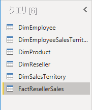
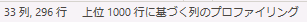
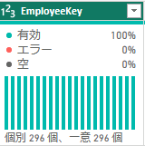
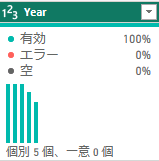
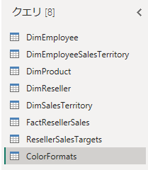
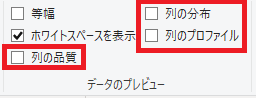

---
lab:
  title: Power BI Desktop でデータを取得する
  module: Get Data in Power BI
---

# Power BI Desktop でデータを取得する

## **ラボのストーリー**

このラボでは、Power BI Desktopを使用して、データに接続する方法、データプレビューの手法を確認しながらソースデータの特性と品質を理解するための内容となっています。 学習目標は以下の通りです。

- Power BI Desktopを開く
- さまざまなデータソースに接続する
- Power Queryを使用してソースデータをプレビューする
- Power Queryでデータプロファイル機能を使用する

**このラボの実施には約45分かかります。**

## **Power BI Desktop の概要**

このタスクでは、スターターPower BI(.pbix)ファイルを開くことから始めます。スターターファイルにデータは含まれませんが、ラボの実施に合わせて構成されています。 スターターファイルでは、次のレポートレベルの設定が無効になっています。

- データの読み込み > 最初の読み込みでデータソースからリレーションシップをインポートする
- データの読み込み > データが読み込まれた後に新しいリレーションシップを自動検出する

"注: この 2 つのオプションを有効にするとデータ モデルを開発するときに役立ちますが、ラボの進行上無効となっています。「**Power BI Desktop でデータを読み込む**」ラボでリレーションシップを作成するときに、それぞれを追加する理由について説明します。"

1. Power BI Desktop を開きます。

    

    ''注1: 既定では、Power BI Desktop の前に [はじめに] ダイアログ ボックスが開きます。[はじめに]をクリックしてサインインして、ポップアップを閉じることができます。''

    ''注2: Power BI Desktopが英語で起動している場合は、[File] > [Options and settings] > [Options]の順に選択し、Optionsウィンドウで[Regional Settings]に表示されるドロップダウンリストから"Japanese(Japan)"を選択してアプリを再起動することで日本語に変更可能です。''

1. スターターPower BI Desktop ファイルを開くには、 **[ファイル] > [開く] > [このデバイスを参照する]** の順に選択します。

1. **[開く]** ウィンドウで、**D:\PL300\Labs\01-prepare-data-with-power-query-in-power-bi-desktop\Starter** フォルダーに移動します。

1. **Sales Analysis** ファイルを選択します。
    ※ファイルを開く際にメールアドレスが求められた場合は、ラボ画面右側の"リソース"タブに記載の"Administrative Username"および"Administrative Password"を使用して組織のアカウントとしてサインインしてください。

1. **[名前を付けて保存]** を使用してファイルのコピーを **D:\PL300\MySolution** フォルダーに保存します。

## **SQL Server からデータを取得する**

このタスクでは、SQL Server データベースに接続し、Power Query でクエリを作成するテーブルをインポートする方法について説明します。

1. **[ホーム]** リボン タブで、**[データ]** グループ内から **[SQL Server]** を選択します。

     ![SQL Server の [データの取得] アイコン](./image/01/01-prepare-data-with-power-query-in-power-bi-desktop_image11.png)

1. **[SQL Server データベース]** ウィンドウの **[サーバー]** ボックスに「**localhost**」と入力して、 **[OK]** を選択します。

1. **[SQL Server データベース]** ウィンドウで資格情報を求めるダイアログが表示されたら、 **[現在の資格情報を使用する]** 、 **[接続]** の順に選択します。

1. **[ナビゲーター]** ウィンドウで、左側の **AdventureWorksDW2020** データベースを展開します。

1. **DimEmployee**テーブルを選択してデータを表示します。

     

1. 右側のウィンドウで、テーブルデータのプレビューを確認します。 プレビューデータで、列と行を確認できます。

1. クエリを作成するため、次の6つのテーブルの横のチェックボックスを選択します。

    - DimEmployee
    - DimEmployeeSalesTerritory
    - DimProduct
    - DimReseller
    - DimSalesTerritory
    - FactResellerSales

1.  **[データの変換]** をクリックして処理が完了すると、Power Queryエディターが開きます。

## **Power Queryエディターでデータをプレビューする**

このタスクでは、Power Queryエディターでデータを確認してプロファイリングできます。 データをクリーニングして変換する場合に役立ちます。

1. **Power Queryエディター** ウィンドウで、左側の **[クエリ]** ペインを確認してください。 **クエリ**ペインには、チェックを付けた各テーブルに対して1つのクエリが含まれています。

     

1. 最初のクエリ **「DimEmployee」** を選択します。

    "SQL Serverデータベースの**DimEmployee**テーブルには、従業員ごとに1行が格納されます。このテーブルの行のサブセットは営業担当者を表します。"

1. 左下隅にあるステータスバーに、テーブル統計情報が提供されます。テーブルには33の列と296の行が含まれています。

     

1. データプレビューペインで水平方向にスクロールして、すべての列を確認します。 最後の5列に、 **「Table」** または **「Value」** のリンクが含まれていることに注意してください。

    "これら5つの列は、データベース内の他のテーブルとのリレーションシップを表します。これらはテーブルを結合するために使用できます。テーブルの結合は「**Power BI Desktop でデータを読み込む**」のラボで実施します。"

1. 列の品質を評価するには、 **「表示」** リボンタブの **「データ プレビュー」** グループ内から、 **「列の品質」** をオンにします。 列の品質機能を使用すると、列にある有効、エラー、または空の値の割合を簡単に判断できます。

     ![リボンの [列の品質] の選択](./image/01/01-prepare-data-with-power-query-in-power-bi-desktop_image23.png)

1. **Position**列の空 (null) 行が94%であることを確認してください。

     ![94% の空の行を示す [列の品質]](./image/01/01-prepare-data-with-power-query-in-power-bi-desktop_image24.png)

1. 列の分布を評価するには、**[表示]** リボン タブの **[データ プレビュー]** グループ内から、**[列の分布]** をオンにします。

1. **Position**列を再度確認し、4 つの個別の値と 1 つの一意の値があることを確認してください。

1. **EmployeeKey**列の列の分布を確認します。296個の個別の値と296個の一意の値があります。

    *個別と一意でカウントが同じ場合は、列に一意の値が含まれていることを意味します。モデル化するときは、いくつかのモデルテーブルに一意の列が含まれることが重要です。このような一意の列を使用して、一対多のリレーションシップを作成できます。これは、「**Power BI Desktop でデータをモデル化する**」ラボで行います。*

     

1. **[クエリ]** ペインで、**DimEmployeeSalesTerritory** クエリを選択します。

    "**DimEmployeeSalesTerritory** テーブルには、従業員と、管理される販売区域の地域が 1 行に格納されます。このテーブルでは、1 人の従業員に多くの地域を関連付けることができます。従業員ごとに、1 つ、2 つ、場合によっては複数の地域を管理する場合があります。このデータをモデル化するときは、多対多のリレーションシップを定義する必要があります。"

1. **[クエリ]** ペインで、**[DimProduct]** クエリを選択します。 **[DimProduct]** テーブルには、会社が販売した商品ごとに 1 行が含まれています。

1. 水平方向にスクロールして、**「DimProductSubcategory」** 列を確認してください。

    "「***Power BI Desktop でデータを読み込む**」ラボでこのクエリに変換を追加するときに、**DimProductSubcategory** 列を使用してテーブルを結合します。"*

1. **[クエリ]** ペインで、**[DimReseller]** クエリを選択します。

    "**DimReseller** テーブルにはリセラーごとに 1 行が含まれます。リセラーは販売、流通を行い、Adventure Works の製品の価値を高めます。"

1. 列値を表示するには、**「表示」** リボン タブの **「データ プレビュー」** グループ内から、**「列のプロファイル」** をオンにします。

1. **BusinessType** 列ヘッダーを選択し、データ プレビュー ペインの下にある新しいペインを確認します。

1. データ プレビュー ウィンドウで、列の統計および値の分布を確認します。

    "データ品質の問題が見て取れます。倉庫を示す"ウェアハウス"の表記ゆれが存在しています(**Warehouse**とスペースが挿入されてしまっている**Ware House**)。"

1. **[Ware House]** バーの上にカーソルを置くと、この値を持つ行が5行存在していることを確認できます。

    "変換を適用して、「**Power BI Desktop でデータを読み込む**」ラボでこれらの 5 つの行のラベルを再設定します。"

1. **[クエリ]** ペインで、**[DimSalesTerritory]** クエリを選択します。  

    "**DimSalesTerritory** テーブルには、**Corporate HQ** (本社) を含めて販売地域ごとに 1 行が含まれています。地域は国に割り当てられ、国はグループに割り当てられます。「**Power BI Desktop でデータをモデル化する**」ラボで、地域、国、またはグループ レベルでの分析をサポートする階層を作成します。"

1. **[クエリ]** ペインで、**[FactResellerSales]** クエリを選択します。

    "**FactResellerSales** テーブルには、販売注文明細ごとに 1 行が含まれています。販売注文には 1 行以上の品目が含まれています。"

1. **TotalProductCost** 列の列の品質を確認して、行の 8% が空であることを確認してください。

    "**TotalProductCost** 列に値がないのは、データ品質の問題です。この問題に対処するために、「**Power BI Desktopでデータを読み込む**」ラボでは、関連する **DimProduct** テーブルに格納されている製品の標準原価を使用して、欠落した値を埋めるための変換を適用します。"

## **CSV ファイルからデータを取得する**

このタスクでは、CSVファイルを使用して新しいクエリを作成します。

1. 新しいクエリを追加するには、**[Power Query エディター]** ウィンドウの **[ホーム]** リボン タブで、**[新しいクエリ]** グループ内から、**[新しいソース]** 下矢印を選択し、**[テキスト/CSV]** を選択します。

1. **「開く」** ウィンドウで、**D:\PL300\Resources** フォルダーに移動し、**ResellerSalesTargets.csv** ファイルを選択します。 **[Open (開く)]** を選択します。

1. **ResellerSalesTargets.csv** ウィンドウで、プレビュー データを確認します。 **[OK]** を選択します。

1. **[クエリ]** ペインで、**ResellerSalesTargets** クエリが追加されていることを確認してください。

    "**ResellerSalesTargets** CSV ファイルには、営業担当者ごとに 1 年につき 1 行が含まれています。各行には、12 個の月次売上目標が記録されます (千単位)。Adventure Works 社の事業年度は、7 月 1 日に開始されます。"

1. 空の値を含む列がない点に注目してください。  月間売上目標がない場合は、代わりにハイフン文字が格納されています。

1. 列名の左側にある各列ヘッダーのアイコンを確認します。 アイコンは、列のデータ型を表します。 **123** は整数で、**ABC** はテキストです。

     

1. **D:\PL300\Resources\ColorFormats.csv** ファイルを使用して先ほどと同様にクエリを作成します。

    "**ColorFormats** CSV ファイルには、製品の色ごとに 1 行が含まれています。各行には、背景色とフォントの色を書式設定する HEX コードが記録されます。"

"これで、**ResellerSalesTargets** と **ColorFormats** という 2 つの新しいクエリが作成されるはずです。"

 

### **仕上げ**

このタスクでは、ラボを完了します。

1. **「表示」** リボン タブの **「データ プレビュー」** グループ内から、次の 3 つのデータ プレビュー オプションをオフにします。

    - 列の品質
    - 列の分布
    - 列のプロファイル

     

1. Power BI Desktop ファイルを**保存**します。 保留中の変更の適用を求めるダイアログが表示されたら、 **[後で適用]** を選択します。

    "ヒント: クエリを適用すると、データ モデルにデータが読み込まれます。先に適用する必要がある変換が多数あるため、現状では実行しません。"
