---
lab:
  title: Power BI でデータ モデルを設計する
  module: Design a Data Model in Power BI
---

# Power BI でデータ モデルを設計する

## **ラボのストーリー**

このラボでは、データ モデルの開発を開始します。 テーブル間のリレーションシップを作成してから、データ モデルのわかりやすさと使いやすさを向上させるために、テーブルと列のプロパティを構成します。 また、階層を作成し、クイック メジャーを作成します。

このラボでは、次の作業を行う方法について説明します。

- モデル リレーションシップを作成する
- テーブルと列のプロパティを構成する
- 階層を作成する

**このラボの実施には約45分かかります。**

## **開始するには**

このタスクでは、ラボの環境を設定します。

1. Power BI Desktop を開きます。

    

    ''ヒント: 既定では、Power BI Desktop の前に [はじめに] ダイアログ ボックスが開きます。サインインすることでポップアップを閉じることができます。''

1. スターター Power BI Desktop ファイルを開くには、 **[ファイル] > [開く] > [このデバイスを参照]** の順に選択します。

1. **D:\PL300\Labs\03-configure-data-model-in-power-bi-desktop\Starter** フォルダーに移動し、**Sales Analysis** ファイルを選択します。

1. 情報ウィンドウが開いている場合はすべて閉じます。

1. **[ファイル] > [名前を付けて保存]** に移動し、ファイルを **D:\PL300\MySolution** フォルダーに保存します。

## **モデル リレーションシップを作成する**

このタスクでは、モデル リレーションシップを作成します。 ラボで使用するテーブル間のリレーションシップを識別しないように構成されています。 これは既定の設定ではありませんが、ラボにおいてモデルの正しいリレーションを作成するために設定しています。

重要: このラボでは、フィールドを参照するために次のような簡略表記を使用します。**Product \| Category**。この例では**Product** はテーブル名、**Category** はフィールド名となります。

1. Power BI Desktop で、左側の **[モデル ビュー]** アイコンを選択します。

     

1. 7 つのテーブルがすべて表示されていない場合は右へスクロールし、テーブルをドラッグしてすべて同時に表示できるよう配置します。

     *ヒント:ウィンドウの最下部にあるズーム コントロールを使用して縮尺を変更することで作業を簡易化できます。"*

1. レポート ビューに戻るには、左側の **[レポート]** ビュー アイコンを選択します。

     

1. すべてのテーブル フィールドを表示するには、 **[データ]** ペインで何も表示されていない領域を右クリックし、 **[すべて展開]** を選択します。

1. テーブル ビジュアルを作成するには、 **[データ]** ペインの **Product** テーブル内にある **Category** フィールドをオンにします。
     "レポートビューのデータペインで各列にあるチェックボックスにチェックを入れることを指します。この操作でレポート上に選択した列に基づく表が表示されます"

1. テーブルに別の列を追加するには、 **[データ]** ペインで、**Sales \| Sales** フィールドをオンにします。

1. テーブル ビジュアルに 4 つの製品カテゴリが一覧表示され、それぞれの Sales 値が同じで、Total も同じであることを確認してください。

    これはこのテーブルが異なる複数のテーブルのフィールドに基づいていることが原因で発生しています。各製品カテゴリには、そのカテゴリの売上が表示されることが想定されますが、これらのテーブル間にはモデルのリレーションシップがないため、**Sales** テーブルの値がフィルタリングされません。そこで、リレーションシップを追加してテーブル間のフィルターを反映します。

     

1. **[モデリング]** リボン タブの **[リレーションシップ]** グループの中から、**[リレーションシップの管理]** を選択します。

     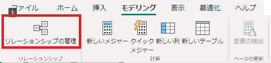

1. **[リレーションシップの管理]** ウィンドウで、リレーションシップがまだ定義されていないことを確認します。

1. **[新規]** をクリックして新たにリレーションシップを作成します。

1. **[リレーションシップの作成]** ウィンドウの最初のドロップダウン リストで、**Product** テーブルを選択します。

      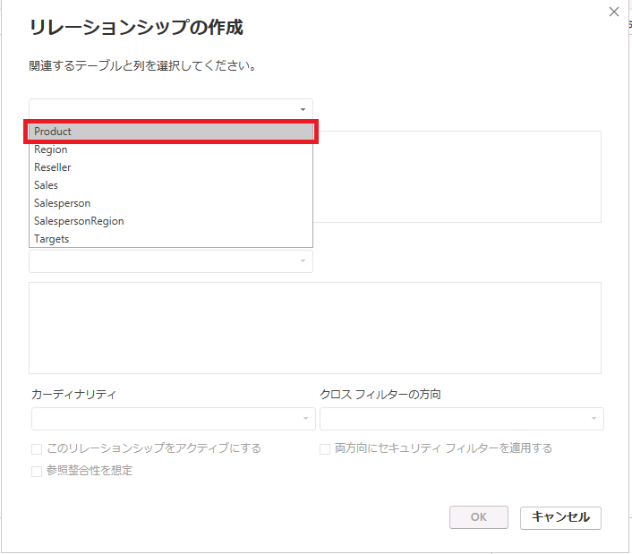

1. 2 番目のドロップダウンリスト (**Product** テーブル グリッドの下) で、**Sales** テーブルを選択します。

      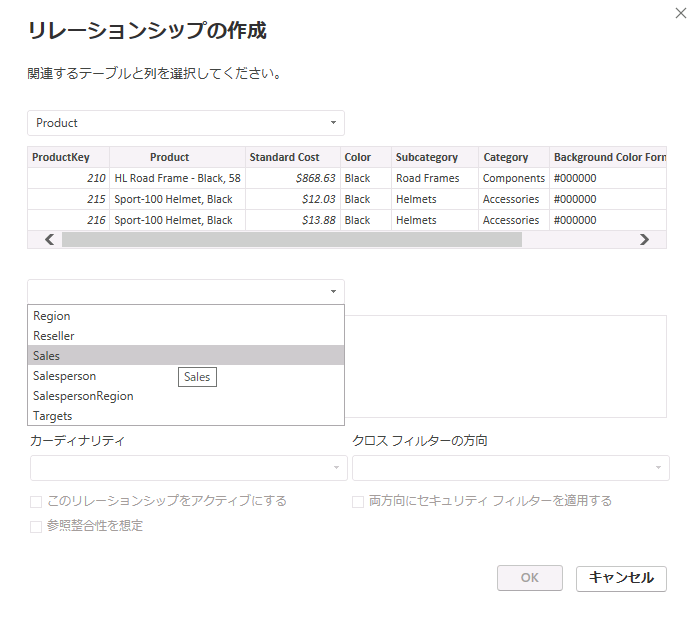

1. 各テーブルの **ProductKey** 列が自動的に選択されていることに確認してください。

     これらの列は同じ名前とデータ型を共有しているため、自動的に関連付けがされています。実際にリレーションシップを作成する場合は、異なる名前で同一のデータを含む列を見つけなければならない場合があります。

1. **[カーディナリティ]** のドロップダウン リストで、**[一対多(1:*)]** が選択されていることを確認します。

     "このカーディナリティは、**Product** テーブルの **ProductKey** 列に一意の値が含まれていることが Power BI によって認識されているため、自動的に検出されています。*一対多のリレーションシップは最も一般的なカーディナリティで、このラボで作成するすべてのリレーションシップがこの種類になります。*

1. **[クロス フィルターの方向]** のドロップダウンリストで、**[単一]** が選択されていることを確認します。

     "単一というフィルターの方向は、フィルターが "一の側" から "多の側" に反映されることを意味します。*この場合、**Product** テーブルに適用されたフィルターは **Sales** テーブルに伝達されますが、逆方向には伝達されません。*

1. **[このリレーションシップをアクティブにする]** がオンになっていることを確認してください。

     "アクティブなリレーションシップではフィルターを伝達します。*リレーションシップを非アクティブとしてマークして、フィルターが伝達しないようにすることも可能です。テーブル間に複数のリレーションシップ パスを存在させ、非アクティブなリレーションシップを設定できます。この場合、モデルの計算で特殊な関数を使用してリレーションを利用することが可能です。*

1. **[OK]** をクリックし、 **[リレーションシップの管理]** ウィンドウで、新しいリレーションシップが表示されていることを確認して、 **[閉じる]** を選択します。

1. モデルビューに移動し、2 つのテーブルの間にコネクタがあることを確認します。
     1. **1** と **(*)** のインジケーターで表されているカーディナリティを解釈できます。
     1. フィルターの方向は、矢印の向きによって表されます。
     1. 実線はアクティブなリレーションシップを表し、破線は非アクティブなリレーションシップを表します。
     1. リレーションシップにカーソルを合わせると、関連する列が強調表示されます。

      

      リレーションシップを作成する簡単な方法として、モデル ダイアグラムで列をドラッグ アンド ドロップすることで新しいリレーションシップを作成できます。

1. **Reseller** テーブルの**ResellerKey** 列を **Sales** テーブルの **ResellerKey** 列にドラッグします。

      

1. 同様に、次の 2 つのモデル リレーションシップを作成します。

      - **Region \| SalesTerritoryKey** から **Sales \| SalesTerritoryKey**
      - **Salesperson \| EmployeeKey** から **Sales \| EmployeeKey**

1. 図では、**Sales** テーブルが図の中央に配置され、関連するテーブルがその周りに配置されるようにテーブルを配置します。 切断されたテーブルを横に配置します。

      

1. レポート ビューでは、テーブル ビジュアルが更新され、製品カテゴリごとに異なる値が表示されていることを確認します。

     ***Product** テーブルに適用されたフィルターが、**Sales** テーブルに反映されるようになりました。*

      

1. Power BI Desktop ファイルを保存します。

## **テーブルを構成する**

このタスクでは階層を作成し、列の非表示、書式設定、分類を行うことによって各テーブルを構成します。

## **Product テーブルを構成する**

このタスクでは、**Product** テーブルを構成します。

1. モデル ビューの **[データ]** ペインで、必要に応じて、**Product** テーブルを展開してすべてのフィールドを表示します。

1. 階層を作成するには、 **[データ]** ペインで **Category** 列を右クリックし、次に **[階層の作成]** を選択します。

     ![[階層の作成] ダイアログ。](./image/03/03-configure-data-model-in-power-bi-desktop_image24.png)

1. **[プロパティ]** ペイン ( **[データ]** ペインの左側) で、 **[名前]** ボックスのテキストを「**Products**」に置き換えます。

1. 階層に 2 番目のレベルを追加するには、**[プロパティ]** ペインで、**[階層]** ドロップダウン リストで **[Subcategory]** を選択します。

1. 階層に 3 番目のレベルを追加するには、**[階層]** のドロップダウン リストで **[Product]** を選択します。

1. 設定した階層を適用するには、**[レベルの変更を適用します]** を選択します。

     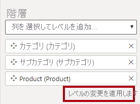

1. **[データ]** ペインで、**Products** 階層に注目します。

     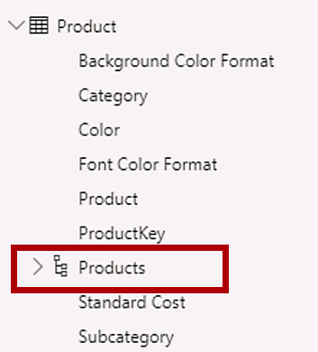

1. 階層レベルを表示するには、**Products** 階層を展開します。

     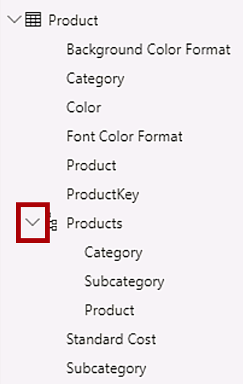

1. **[データ]** ペインで**Background Color Format** 列を選択します。

1. **Ctrl** キーを押しながら、**[Font Color Format]** 列を選択します。

1. **[プロパティ]** ウィンドウの **[フォルダーの表示]** ボックスに、「**Formatting**」と入力してエンターを押します。

     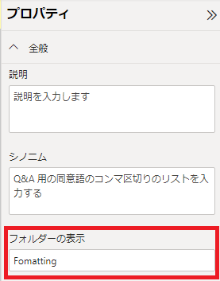

1. **[データ]** ペインで、2 つの列がフォルダー内に表示されるようになったことを確認します。
   
     

## **Region テーブルを構成する**

このタスクでは、**Region** テーブルを構成します。

1. **Region** テーブルで、次の 3 つのレベルを持つ **Regions** という名前の階層を作成します。

     - Group
     - Country
     - Region

     

1. **Country** 列 を選択します。

1. **[プロパティ]** ペインで、ペインの最下部にある **[詳細]** セクションを展開し、次に **[データ カテゴリ]** のドロップダウン リストで **[国/地域]** を選択します。

     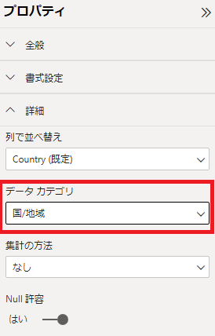

## **Reseller テーブルを構成する**

このタスクでは、**Reseller** テーブルを構成します。

1. **Reseller** テーブルに、次の 2 つのレベルを持つ **Resellers** という名前の階層を作成します。

     - Business Type
     - Reseller

1. 同様に次の 4 つのレベルを持つ **Geography** という名前の階層を作成します。

     - Country-Region
     - State-Province
     - City
     - Reseller

1. **[Country-Region]** 、 **[State-Province]** 、および **[City]** 列の **[データ カテゴリ]** を **[国/地域]** 、 **[都道府県]** 、 **[市区町村]** にそれぞれ設定します。

## **Sales テーブルを構成する**

このタスクでは、**Sales** テーブルを構成します。

1. **Sales** テーブルで、**Cost** 列を選択します。

1. **[プロパティ]** ペインの **[説明]** ボックスに、「*Based on standard cost*」と入力します。

    "*説明は、テーブル、列、階層、またはメジャーに適用できます。 **[データ]** ペインでフィールドの上にカーソルを置いたとき、説明に記載したテキストが表示されます。* "

1. **Quantity** 列を選択します。

1. **「プロパティ」** ペインの **「書式設定」** セクションで、**「桁区切り記号」** を **「はい」** にスライドします。

1. **Unit Price** 列を選択します。

1. **[プロパティ]** ペインの **[書式設定]** セクションで、 **[小数点以下の桁数]** プロパティを **2** に設定します。

1. **[詳細]** グループ (下にスクロールして見つける必要がある場合があります) の **[集計の方法]** のドロップダウン リストで、**[平均]** を選択します。

    既定では数値型の列は値を合計して集計されます。そのため、レートを表す **Unit Price** のような列には適していません。集計方法を平均に設定すると有用な結果が得られるようになります。

## **プロパティを一括更新する**

このタスクでは、1 回の一括更新で複数の列を更新します。 この方法を使用して列を非表示にし、列の値を書式設定します。

1. **[データ]** ペインで、**Product \| ProductKey** 列を選択します。

1. **Ctrl** キーを押しながら、次の 13 個の列 (別々のテーブルに存在) を選択します。

     - Region \| SalesTerritoryKey
     - Reseller \| ResellerKey
     - Sales \| EmployeeKey
     - Sales \| ProductKey
     - Sales \| ResellerKey
     - Sales \| SalesOrderNumber
     - Sales \| SalesTerritoryKey
     - Salesperson \| EmployeeID
     - Salesperson \| EmployeeKey
     - Salesperson \| UPN
     - SalespersonRegion \| EmployeeKey
     - SalespersonRegion \| SalesTerritoryKey
     - Targets \| EmployeeID

1. **[プロパティ]** ペインで、 **[非表示]** プロパティを **[はい]** にスライドします。

    *これらの列はリレーションシップによって使用されるか、行レベルのセキュリティ構成または計算ロジックで使用されるため非表示に設定します。*

    「**Power BI Desktop で DAX 計算を作成する**」のラボでは、**SalesOrderNumber** を計算に使用します。

1. 次の 3 列を複数選択します。

     - Product \| Standard Cost
     - Sales \| Cost
     - Sales \| Sales

1. **[プロパティ]** ペインの **[書式設定]** セクションで、**[小数点以下の桁数]** プロパティを **0** (ゼロ) に設定します。

## **モデル インターフェイスを確認する**

この演習では、レポート ビューに切り替えてモデル インターフェイスを確認します。

## **モデル インターフェイスを確認する**

このタスクでは、レポート ビューに切り替えてモデル インターフェイスを確認します。

1. レポート ビューに切り替えます。

1. **[データ]** ペインで以下の点を確認してください。

     - 列、階層、およびレベルはフィールドとして扱われ、レポートのビジュアルを構成するために使用できます
     - レポート作成に関連するフィールドのみが表示されます
     - **SalespersonRegion** テーブルは、すべてのフィールドが非表示になっているため表示されません
     - **Region** および **Reseller** テーブルの一部フィールドには、空間アイコンが付きます
     - 既定では、シグマ記号 (Ʃ) の付いたフィールドが集計されます
     - **Sales \| Cost** フィールド上にカーソルを置くと、ヒントが表示されます

1. **Sales \| OrderDate** フィールドを展開し、日付階層が表示されることを確認します。

    **Targets \| TargetMonth** フィールドも同様の階層を提供します。これらはデフォルトで組み込まれています。ただし、年度の開始時期に問題があります。Adventure Works の会計年度は、毎年 7 月 1 日に始まります。ただし、この自動的に作成された日付階層では、日付階層の年は毎年 1 月 1 日に始まります。

     

 自動動作をオフにします。 「**Power BI Desktop で DAX 計算を作成する**」のラボでは、DAX を使用して日付テーブルを作成し、Adventure Works 社のカレンダーを定義するように構成します。

1. 自動/日付時刻をオフにするには、 **[ファイル] > [オプションと設定] > [オプション] > [現在のファイル]** グループに移動し、 **[データの読み込み]** を選択します。
    1. **[タイム インテリジェンス]** セクションで、**[新しいファイルの自動の日付/時刻]** チェック ボックスをオフにします。

     

1. **[データ]** ペインで、日付階層を使用できなくなっていることを確認します。

     

## **クイック メジャーを作成する**

この演習では、2 つのクイック メジャーを作成します。

## **クイック メジャーを作成する**

このタスクでは、利益と利益率を計算するための 2 つのクイック メジャーを作成します。

クイック メジャーによって計算式が作成されます。シンプルで一般的な計算を簡単かつ迅速に作成できます。「**Power BI Desktop で DAX 計算を作成する**」のラボでは、このツールを使用せずにメジャーを作成します。

1. **[データ]** ペインで、**Sales** テーブルを右クリックし、 **[新しいクイック メジャー]** を選択します。

     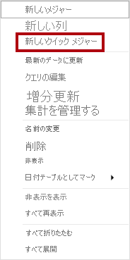

1. **[クイック メジャー]** ウィンドウの **[計算]** ボックスの一覧で、**[数学演算]** グループ内から **[減算]** を選択します。

     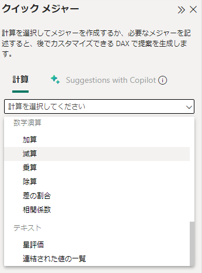

1. **[クイック メジャー]** ウィンドウの**基準値**の**[+データの追加]**をクリックし、**Sales | Sales** を選択します。

1. **[クイック メジャー]** ウィンドウの**減算する値**の**[+データの追加]**をクリックし、**Sales | Cost** を選択します。

     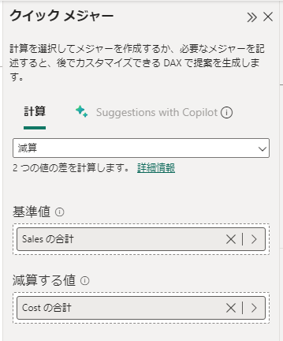

1. **[データ]** ペインの **Sales** テーブル内で、新しいメジャーに注目します。
   
    メジャーには電卓アイコンが表示されます。
    
     
    
1. メジャーの名前を変更するには、メジャーを右クリックし、 **[名前の変更]** を選択して、名前を **Profit** に変更します。

    *フィールドの名前は、対象をダブルクリックするか、選択後に **F2** キーを押しても変更可能です。*

1. **Sales** テーブルで、次の要件に基づいて 2 番目のクイック メジャーを追加します。

     - **[除算]** 数学演算を使用します
     - **[分子]** を **Sales \| Profit** フィールドに設定します
     - **[分母]** を **Sales \| Sales** フィールドに設定します
     - メジャーの名前を **Profit Margin** に変更します

1. **Profit Margin** メジャーを選択してから、**[メジャー ツール]** コンテキスト リボンで、形式を小数点以下 2 桁の **[パーセント]** に設定します。

     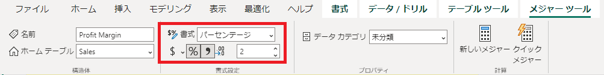

1. 2 つのメジャーをテストするには、最初にレポート ページで**テーブル** ビジュアルを選択します。

1. **[データ]** ペインで、2 つのメジャーをオンにします。

     

1. 右側のガイドを選択してドラッグし、テーブル ビジュアルを広げます。

     

1. メジャーが適切にフォーマットされた適切な結果を生成することを確認します。

     

## **多対多リレーションシップを作成する**

このタスクでは、**Salesperson** テーブルと **Sales** テーブルの間に多対多のリレーションシップを作成します。

 "このラボでは、フィールドを参照するために簡略表記を使用します。*次のようになります。**Salesperson \| Salesperson** 。この例では、**Salesperson** はテーブル名、**Salesperson** はフィールド名です。*

1. Power BI Desktop のレポート ビューの **[データ]** ペインで、次の 2 つのフィールドをオンにして、**テーブル** ビジュアルを作成します。

     - Salesperson \| Salesperson
     - Sales \| Sales

     

     *このテーブルには、各営業担当者の売上が表示されます。しかし、営業担当者と営業の間には別のリレーションシップもあります。営業担当者により、担当する地域の数は 1 つ、2 つ、またはそれより多い可能性もあります。さらに、1 つの営業地域に複数の営業担当者が割り当てられている場合もあります。*

     *パフォーマンス管理の観点からは、営業担当者の (割り当てられた担当地域に基づく) 売上を分析し、売上目標と比較する必要があります。次の演習では、この分析をサポートするリレーションシップを作成します。*

1. **Michael Blythe** の売上が約 900 万ドルであることにご注意ください。

1. モデル ビューに切り替え、**SalespersonRegion** テーブルをドラッグして、**Region** テーブルと **Salesperson** テーブルの間に配置します。

1. ドラッグ アンド ドロップ手法を使用して、次の 2 つのモデル リレーションシップを作成します。

     - **Salesperson \| EmployeeKey** から **SalespersonRegion \| EmployeeKey**
     - **Region \| SalesTerritoryKey** から **SalespersonRegion \| SalesTerritoryKey**

     ***SalespersonRegion** テーブルは、ブリッジ テーブルと考えることができます。*

1. レポート ビューに切り替えて、ビジュアルが更新されていないことを確認します。Michael Blythe の売上結果は変更されていません。

1. モデル ビューに戻り、**Salesperson** テーブルからのリレーションシップ フィルターの方向 (矢印の向き) を確認します。

    **Salesperson** テーブルによって **Sales** テーブルがフィルター処理されると考えます。また、**SalespersonRegion** テーブルにフィルターが適用されますが、**Region** テーブルには引き続き反映されていません。

     

1. **Region** テーブルと **SalespersonRegion** テーブル間のリレーションシップを編集するには、リレーションシップをダブルクリックします。

1. **[リレーションシップの編集]** ウィンドウの **[クロス フィルターの方向]** ドロップダウン リストで、 **[両方]** を選択します。

1. **[両方向にセキュリティ フィルターを適用する]** チェック ボックスをオンにし、[OK] を選択します。

     

1. これでリレーションシップの矢印の向きが両方になったことに注意してください。

     

1. レポート ビューに切り替えると、販売の値が変更されていないことが確認できます。

     この問題は、今度は、**Salesperson** テーブルと **Sales** テーブルの間に 2 つのフィルター伝播パスが設定されていることに起因します。この曖昧さは、"テーブル数最小" の評価に基づいて内部的に解決されます。フィルターを明確にするためにモデルの設計ではこのような曖昧さが存在しないようにする必要があります。この問題には、このラボの後のパートで対処するか、「**Power BI Desktop で DAX 計算を作成する**」 のラボを実行することで対処可能です。

1. モデル ビューに切り替えて、ブリッジング テーブルを介してフィルターを強制的に伝播します。 **Salesperson** テーブルと **Sales** テーブルのリレーションシップを編集 (ダブルクリック) します。

1. **[リレーションシップの編集]** ウィンドウで、 **[このリレーションシップをアクティブにする]** チェック ボックスをオフにし、 **[OK]** を選択します。

     *フィルターの伝播が、アクティブなパスのみを進むようになります。*

1. 図で、非アクティブなリレーションシップは破線で表されていることを確認してください。

      

1. レポート ビューに切り替えて、Michael Blythe の売上が今度は約 2,200 万ドルになっていることを確認します。

      

1. 今回の環境のように各営業担当者の売上がテーブル合計を上回る場合が存在します。

      これは地域の売上実績が 2 重、3 重などにカウントされることに起因し、多対多のリレーションシップでしばしば発生する事象です。営業担当者 Brian Welcker の売上金額は合計売上金額と同じですが、これは彼が営業部長であることに起因し、正しい結果です。彼の売上は、すべての地域の売上によって導出されます。

      多対多リレーションシップは現在機能していますが、営業担当者による販売を分析することはできません。「**Power BI Desktop で DAX 計算を作成する**」のラボで、営業担当者に割り当てられた販売地域での売上分析ができる計算テーブルを導入すると、リレーションシップを使用することができます。

1. モデリング ビューに切り替えて、図で **Salesperson** テーブルを選択します。

1. **[プロパティ]** ペインの **[名前]** ボックスで、テキストを "**Salesperson (Performance)**" に置き換えます。

*名前が変更されたテーブルは、その目的を反映するようになりました。これは、担当営業地域の売上に基づいて営業担当者の実績を報告および分析するために使用されます。*

## **Targets テーブルを関連付ける**

このタスクでは、**Targets** テーブルへのリレーションシップを作成します

1. **Salesperson (Performance) \| EmployeeID** 列と **Targets \| EmployeeID** 列からのリレーションシップを作成します。

1. レポート ビューで、**Targets \| Target** フィールドをテーブル ビジュアルに追加します。

1. テーブル ビジュアルのサイズを変更し、すべての列が表示されるようにします。

     

 売上と目標を視覚化することが可能になりましたが、2 つの点において注意が必要です。第 1 に、期間に対するフィルターがないため、目標には将来の目標金額も含まれます。第 2 に、目標は加算できないため、合計が表示されないようにする必要があります。これらは、ビジュアルの書式設定を使用して無効にするか、計算ロジックを使用して削除できます。「**Power BI Desktop で高度な DAX 計算を作成する**」のラボでは、2 番目の方法に従って、複数の営業担当者をフィルター処理すると BLANK が返される目標メジャーを作成します。

### **仕上げ**

このタスクでは、ラボを完了します。

Power BI Desktop ファイルを保存し、クエリの適用を求められたら **[後で適用]** を選択します。
