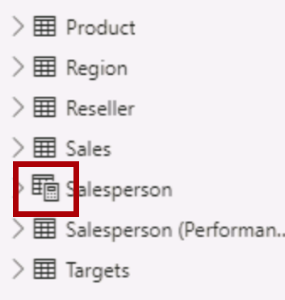
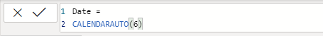
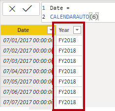
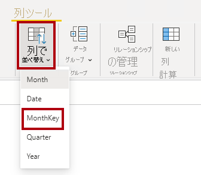
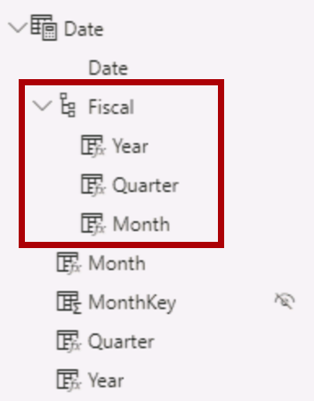
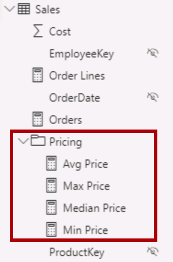
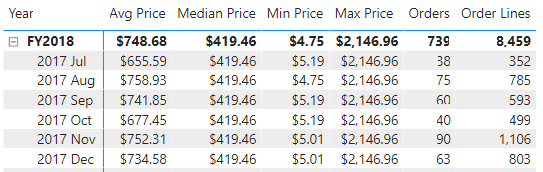

---
lab:
  title: Power BI Desktop で DAX 計算を作成する
  module: Create Model Calculations using DAX in Power BI
---


# Power BI Desktop で DAX 計算を作成する

## **ラボのストーリー**

このラボでは、Data Analysis Expressions (DAX) を使用して、計算テーブル、計算列、およびシンプルなメジャーを作成します。

このラボでは、次の作業を行う方法について説明します。

- 計算テーブルを作成する
- 計算列を作成する
- メジャーを作成する

**このラボの実施には約45分かかります。**

## **計算テーブルを作成する**

この演習では、2 つの計算テーブルを作成します。 1 つ目は、**Sales** テーブルとの間の直接的なリレーションシップを持つ**Salesperson** テーブル、2つ目は、**Date** テーブルを作成します。

※前のラボから続けて実行する場合は次のタスクから開始してください。

1. Power BI Desktop を開きます。

    

1. スターター Power BI Desktop ファイルを開くには、 **[ファイル] > [開く] > [このデバイスを参照]** の順に選択します。

1. **[開く]** ウィンドウで、**D:\PL300\Labs\04-create-dax-calculations-in-power-bi-desktop\Starter** フォルダーに移動し、**Sales Analysis** ファイルを開きます。

1. 情報ウィンドウが開いている場合はすべて閉じます。

1. リボンの下の黄色の警告メッセージに注目してください。

    "このメッセージは、クエリがモデル テーブルとして適用されていないことに起因します。クエリはこのラボの後半で適用します。"

    "警告メッセージを無視するには、黄色の警告メッセージの右側にある **[X]** を選択します。"

1. ファイルのコピーを作成するには、 **[ファイル] > [名前を付けて保存]** の順に移動し、**D:\PL300\MySolution** フォルダーに保存します。

1. 変更の適用を求めるメッセージが表示されたら、**[後で適用]** を選択します。

## **Salesperson テーブルを作成する**

このタスクでは、**Sales** との直接的なリレーションシップを持つ**Salesperson** 計算テーブルを作成します。

計算テーブルを作成するには、最初にテーブル名を入力し、続けて等号 (=) とテーブルにデータが返される DAX 式を入力します。 データ モデル内に既に存在しているテーブル名は使用できません。

数式バーでは、DAX 式の入力がサポートされています。 オートコンプリート、Intellisense、色分けなどの機能が用意されており、すばやく正確に数式を入力できます。

1. Power BI Desktop のレポート ビューで、**[モデリング]** リボンの **[計算]** グループの中から、**[新しいテーブル]** を選択します。

     

2. 数式バー (計算の作成または編集時に、リボンのすぐ下に表示されます) に、「**Salesperson =**」と入力して **Shift + Enter** キーを押し、「**'Salesperson (Performance)'**」と入力して **Enter** キーを押します。

    *"利便性のために、このラボのすべての DAX 定義は、**D:\PL300\Labs\04-create-dax-calculations-in-power-bi-desktop\Assets\Snippets.txt** にあるスニペット ファイルからコピーできます。"*

     

     "これにより既存の**Salesperson (Performance)** テーブルのコピーが作成されます。コピーされるのはデータのみで、表示や書式設定などのモデル プロパティはコピーされません。"

     "数式が長くて複雑な場合、可読性向上のために"空白" (改行やスペース、タブなど) を入力することも可能です。改行を入力するには、**Shift + Enter** キーを押します。"

1. **[データ]** ペインで、テーブル アイコンに電卓アイコンが重なる表示になっているものは計算テーブルを示しています。

    

    "注: 計算テーブルは、テーブルを返す DAX 式を使用して定義されます。計算テーブルはデータ モデルのサイズが大きくなる傾向にあります。数式の依存関係が更新されるたびに再計算が行われます。"

    "Power Query に由来するテーブルとは異なり、計算テーブルを使用して外部データ ソースからデータを読み込むことはできません。*既にデータ モデルに読み込まれている内容をベースとした変換のみが実行できます。"*

1. [モデル] ビューに切り替え、**Salesperson** テーブルが使用可能であることが確認できます。

1. **Salesperson \| EmployeeKey** 列から **Sales \| EmployeeKey** 列へのリレーションシップを作成します。

1. **Salesperson (Performance)** テーブルと **Sales** テーブルの間の非アクティブなリレーションシップを右クリックし、**[削除]** を選択します。 削除するかどうかを確認するメッセージが表示されたら、 **[はい]** を選択します。

1. **Salesperson** テーブルで、次の列を複数選択し、非表示にします (**非表示**プロパティを **[はい]** に設定)。

    - EmployeeID
    - EmployeeKey
    - UPN

1. モデル ダイアグラムで、**Salesperson** テーブルを選択します。

1. **[プロパティ]** ペインの **[説明]** ボックスに、**売上に関連する営業担当者**と入力します。
   
1. **Salesperson (Performance)** テーブルの **[説明]** ボックスに対しては、**地域に関連する営業担当者**と入力します。

"これにより、販売員を指標とした分析時にデータ モデル別に 2 つの手段が使用可能になりました。***Salesperson** テーブルを使用すると、販売員による売上を分析できます。一方、**Salesperson (Performance)** テーブルでは、販売員に割り当てられた販売地域での売上を分析できます。"*

## **Date テーブルを作成する**

このタスクでは、**Date** テーブルを作成します。

1. データ ビューに切り替えます。 **[ホーム]** リボン タブの **[計算]** グループの中から、**[新しいテーブル]** を選択します。

    

1. 数式バーに次のように入力します。

    ```
    Date =  
    CALENDARAUTO(6)
    ```

    

    "CALENDARAUTO() 関数を使用すると、日付値で構成される単一列のテーブルが返されます。自動的にデータ モデルの日付列がスキャンされ、データ モデルに格納されている最も古い日付値と最も新しい日付値が決定されます。次に、この範囲内の各日付に対して 1 つの行が作成されます。範囲をいずれかの方向に拡張して、すべての年のデータが格納されます。"

    "この関数は、1 年の最後の月を引数として渡すことができます。*省略した場合は12 が設定され、12 月が年度の最終月として認識されます。本ラボでは "6" が入力されているため、6 月が年度の最終月として設定されています。"*

1. 日付値の列を確認します。

    

1. *表示される日付は、米国の地域設定を使用して書式設定(mm/dd/yyyy)されています。*

    左下のステータス バーからテーブルの統計情報を確認すると、1826 行のデータが生成されています。これは 5 年間分の日付データを表しています。


## **計算列を作成する**

このタスクでは、列をさらに追加して、さまざまな期間によるフィルター処理とグループ化を可能にします。 また、計算列を作成して、他の列の並べ替え順序の制御も行います。

*"このラボのDAX 定義は、**D:\PL300\Labs\04-create-dax-calculations-in-power-bi-desktop\Assets\Snippets.txt** にあるスニペット ファイルからコピーできます。"*

1. **[テーブル ツール]** コンテキスト リボンの **[計算]** グループ内から、**[新しい列]** を選択します。

    

1. 数式バーに次のように入力 (またはスニペット ファイルからコピー) して、**Enter** キーを押します。

    ```
    Year =
    "FY" & YEAR('Date'[Date]) + IF(MONTH('Date'[Date]) > 6, 1)
    ```

    "計算列を作成するには、最初に列名を入力し、続けて等号 (=) と、単一値の結果が返される DAX 式を入力します。テーブル内に既に存在している列名は使用できません。"

    "この数式では日付の年の値が使用されますが、月が 6 月よりも後の場合は、年の値に 1 が加算されます。*このようにして、Adventure Works 社の会計年度が計算されます。"*

1. 新しい列が追加されたことを確認します。

    

1. スニペットのファイル定義を使用して、**Date** テーブルに対して次の 2 つの計算列を作成します。

    - Quarter
    - Month

    

1. 計算を確認するために、レポート ビューに切り替えます。

1. 新しいレポート ページを作成するために、[Page 1] の横にあるプラス アイコンを選択します

    

1. 新しいレポート ページに行列の視覚エフェクトを追加するには、**[視覚化]** ペインで、**マトリックス**（行列）の視覚エフェクトの種類を選択します。

    *ヒント:各アイコンの上にカーソルを置くと、視覚エフェクトの種類について説明するヒントが表示されます。"*

    

1. **[データ]** ペインの **Date** テーブル内から **Year** フィールドを**行**のボックスにドラッグします。

    

1. **Month** フィールドを **Year** フィールドのすぐ下にある **[行]** のボックスにドラッグします。

    

1. マトリックス ビジュアルの右上 (または右下) にある、分岐した二重矢印アイコンを選択します (すべての年を 1 レベル下に展開します)。

    

1. 年が月に展開され、月が時系列順ではなくアルファベット順に並べ替えられていることがわかります。

     *既定では、テキスト値はアルファベット順に、数値は昇順に、日付は最も古いものから最も新しいものの順に並べ替えられます。*

     

1. **Month** フィールドの並べ替え順序をカスタマイズするために、データ ビューに切り替えます。

1. **Date** テーブルに **MonthKey** 列を追加します。

     ```
     MonthKey =
     (YEAR('Date'[Date]) * 100) + MONTH('Date'[Date])
     ```

     *この数式により、年と月の各組み合わせに対する数値が計算されます。*

1. データ ビューで、新しい列に数値が含まれていることを確認します。

     

1. もう一度レポート ビューに切り替えます。 **[データ]** ペインで、**Month** フィールドを選択します。

1. **[列ツール]** コンテキスト リボンで、**[列で並べ替え]** をクリックして**[MonthKey]** を選択します。

     

1. これにより、月が時系列順に並べ替えられるようになります。

     

## **Date テーブルを完成させる**

このタスクでは、1 つの列を非表示にし、階層を作成することで、**Date** テーブルのデザインを完成させます。 その後、**Sales** テーブルと **Targets** テーブルに対するリレーションシップを作成します。

1. モデル ビューに切り替えます。 **Date** テーブルで、**MonthKey** 列を非表示にします。


1. 右側の **[データ]** ペインで **Date** テーブルを選択し、**Year** 列で右クリックし、 **[階層の作成]** を選択します。 

1. 新しく作成した階層を右クリックして **[名前を変更]** をクリックし、**Fiscal** という名前に変更します。


1. 次の 2 つの残りのフィールドを Fiscal 階層に追加します。これを行うには、 **[データ]** ペインでこれらを選択してから右クリックし、 **[階層の追加]**  -> **Fiscal** の順に選択します。

    - Quarter
    - Month

    

1. 次の 2 つのモデル リレーションシップを作成します。

    - **Date \| Date** から **Sales \| OrderDate** へ
    - **Date \| Date** から **Targets \| TargetMonth** へ

1. 次の 2 つの列を非表示にします。

    - Sales \| OrderDate
    - Targets \| TargetMonth

## **Date テーブルをマークする**

このタスクでは、**Date** テーブルを日付テーブルとしてマークします。

1. レポート ビューに切り替えます。 **[データ]** ペインで、**Date** テーブル (フィールドではなくテーブル) を選択します。

1. **[テーブル ツール]** コンテキスト リボンの**[日付テーブルとしてマーク]** をクリックして、**[日付テーブルとしてマーク]** を選択します。

    

1. **[日付テーブルとしてマーク]** ウィンドウの **[日付列]** ドロップダウン リストから、**[日付]** を選択します。 **[OK]** を選択します。

    

1. Power BI Desktop ファイルを保存します。

    ''ここまでの作業でDateテーブルで日付 (時刻) が定義されていることをアプリ側で認識できるようになりました。これにより、タイム インテリジェンスの計算に使用することが可能になりました。後に続く「**Power BI Desktop で高度な DAX 計算を作成する**」ラボでは、タイム インテリジェンスの計算を実施します。''

    ''データ ソースに日付テーブルがない場合は、今回のタスクで実施したように日付テーブルを設計します。''

## **単純なメジャーを作成する**

このタスクでは、シンプルなメジャーを作成します。 単純なメジャーは、単一の列の値を集計するか、テーブルの行をカウントします。

1. レポート ビュー上にある新規に作成したページの **[データ]** ペインで、**Sales \| Unit Price** フィールドをマトリックス上にドラッグします。

    "このラボでは、フィールドを参照するために簡略表記を使用します。*次のようになります。**Sales \| Unit Price**。この例では、**Sales** はテーブル名、**Unit Price** はフィールド名です。"*

    

    *「**Power BI Desktop でデータをモデル化する**」のラボでは、**Unit Price** 列を **[平均]** で要約するように設定しました。マトリックスに表示される結果は、月単位の平均単価 (単価の合計を全体数で割ったもの) です。*

1. ビジュアル フィールド ウィンドウ (「**視覚化**」ウィンドウの下) にある「**値**」のボックスに、「**Unit Price**」が一覧表示されていることを確認してください。

    

1. **[Unit Price]** の下向き矢印を選択して、使用可能なメニュー オプションを確認します。

    

    "数値列を使用した場合、レポートの作成者は設計時に列の値をどのように集計するかを決定できます。集計方法の選択によっては、報告結果が基となるデータとずれる可能性があります。この後の手順で実施するように、メジャーを作成して集計を行うことによって後から集計方法を変更できないよう設計することが可能です。"

1. メジャーを作成するには、 **[データ]** ペインで **Sales** テーブルを右クリックして、 **[新しいメジャー]** を選択します。

1. 数式バーに、次のメジャーの定義を追加します。

    ```
    Avg Price =  
    AVERAGE(Sales[Unit Price])
    ```

1. **[Avg Price]** メジャーをマトリックス ビジュアルに追加します。

1. **Unit Price** 列と同じ値で書式設定は異なる列が生成されます。

1. **[値]** ボックスで、 **[Avg Price]** フィールドのコンテキスト メニューを開き、集計手法を変更できないことを確認してください。

    
    "メジャーの集計動作を変更することはできません。"

1. スニペットのファイル定義を使用して、**Sales** テーブルに対して次の 5 つのメジャーを作成します。

    - Median Price
    - Min Price
    - Max Price
    - Orders
    - Order Lines

    "**Orders** メジャーで使用される DISTINCTCOUNT() 関数では、各注文が 1 回だけカウントされます (重複は無視されます)。***Order Lines** メジャーで使用される COUNTROWS() 関数は、テーブルに対して動作します。"*

    "この場合、注文数は、**SalesOrderNumber** 列の一意の値をカウントすることによって計算されますが、注文の行の数は、単純にテーブルの行の数になります (各行が 1 つの注文の 1 行になります)。"

1. モデル ビューに切り替えて、価格の 4 つのメジャーを複数選択します。**Avg Price**、**Max Price**、**Median Price**、および **Min Price** です。

1. 複数選択したメジャーに対して、次の要件を構成します。

     - 書式を小数点以下 2 桁に設定する

     - **Pricing** という名前の表示フォルダーに割り当てる

     

1. **Unit Price** 列を非表示にします。

     "これにより、レポート作成者が **Unit Price** 列を使用できなくなりました。*モデルに追加した価格メジャーを使用する必要があります。この設計方法では、レポート作成者が不適切な集計をすることができなくなります。"*

1. **[Order Lines]** メジャーと **[Orders]** メジャーを複数選択して、次の要件を設定します。

     - 桁区切り記号を使用するように書式を設定する
     - **Counts** という名前の表示フォルダーに割り当てる
       

1. レポート ビューにあるマトリックス ビジュアルの **[値]** ウエル/領域で、 **[Unit Price]** フィールドの **[X]** を選択して削除します。

     

1. ページの幅と高さに合わせて、行列の視覚エフェクトのサイズを大きくします。

1. マトリックス ビジュアルに次の 5 つのメジャーを追加します。

     - Median Price
     - Min Price
     - Max Price
     - Orders
     - Order Lines

1. 結果が適切に表示され、正しく書式設定されていることを確認します。
     

## **追加のメジャーを作成する**

このタスクでは、より複雑な数式を使用するメジャーをさらに作成します。

1. [レポート] ビューで **[Page 1]** に移動してテーブル ビジュアルを確認し、 **[Target]** 列の合計を確認します。

    

2. テーブル ビジュアルを選択し、**[視覚化]** ウィンドウで **[Target]** フィールドを削除します。

3. **Targets \| Target** 列の名前を、**Targets \| TargetAmount** に変更します。

    "*ヒント: レポート ビューで列の名前を変更するには、いくつかの方法があります。 **[データ]** ペインで、列を右クリックしてから **[名前の変更]** を選択するか、列をダブルクリックするか、**F2** キーを押します。* "

    "***Target** という名前のメジャーを作成しようとしています。同じテーブル内に、同じ名前を持つ列とメジャーを持つことはできません。* "

4. **Targets** テーブルに対して、次のメジャーを作成します。

    ```
    Target =
    IF(
    HASONEVALUE('Salesperson (Performance)'[Salesperson]),
    SUM(Targets[TargetAmount])
    )
    ```

    *HASONEVALUE() 関数によって、**Salesperson** 列内の単一の値がフィルター処理されているかどうかがテストされます。true の場合は、式によって (その販売員のみの) 目標金額の合計が返されます。false の場合は、空白が返されます。*

5. **Target** メジャーを、小数点以下 0 桁に書式設定します。

    *ヒント: **[メジャー ツール]** コンテキスト リボンを使用できます。*

6. **TargetAmount** 列を非表示にします。

    "*ヒント: **[データ]** ペインで列を右クリックして **[非表示]** を選択することができます。* "

7. テーブルの視覚エフェクトに **Target** メジャーを追加します。

8. **Target** 列の合計が空白になっていることがわかります。

    

9. スニペットのファイル定義を使用して、**Targets** テーブルに対して次の 2 つのメジャーを作成します。

    - Variance
    - Variance Margin

10. **Variance** メジャーを、小数点以下 0 桁に書式設定します。

11. **Variance Margin** メジャーを、小数点以下 2 桁のパーセンテージとして書式設定します。

12. テーブルの視覚エフェクトに、**Variance** メジャーと **Variance Margin** メジャーを追加します。

13. すべての列と行が表示されるように、テーブル ビジュアルのサイズを変更します。

     

     ''すべての営業担当者が目標を達成していないように見えますが、テーブル ビジュアルはまだ特定の期間でフィルタリングされていません。「**Power BI Desktop でレポートをデザインする**」ラボにて、ユーザーが選択した期間でフィルター処理を行う販売実績レポートを生成します。''

14. **[データ]** ペインの右上隅で、ペインを折りたたんでから展開します。

     ''ペインを折りたたんで再び開くと、内容がリセットされます。''**

15. 一覧の先頭に **[Targets]** テーブルが表示されるようになったことが確認できます。

     

     *表示されるメジャーのみを含むテーブルは、自動的に一覧の先頭に表示されます。*

### **仕上げ**

Power BI Desktop ファイルを保存します。

''「**Power BI Desktop で高度な DAX 計算を作成する**」ラボでは、DAX を使用して、より高度な計算でデータ モデルを強化します。''**
