---
lab:
  title: Power BI Desktop でレポートをデザインする
  module: Create Reports in Power BI Desktop
---

# Power BI Desktop でレポートをデザインする

## **ラボのストーリー**

このラボでは、3 ページのレポートを作成します。 次に、Power BI にそれを発行し、そこでレポートを開いて操作します。

このラボでは、次の作業を行う方法について説明します。

- レポートをデザインする
- 視覚化のフィールドと書式プロパティを構成する

**このラボの実施には約45分かかります。**

## **レポートを作成する**

このタスクでは、スタート レポートを開いてラボの環境を設定します。

1. Power BI Desktop から、 **[ファイル] > [開く] > [このデバイスを参照]** の順に移動します。

1. **D:\PL300\Labs\06-design-report-in-power-bi-desktop\Starter** フォルダーで **Sales Analysis** ファイルを開きます。

1. **[ファイル]**  >  **[名前を付けて保存]** の順に移動して、ファイルのコピーを作成し、そのコピーを **D:\PL300\MySolution** フォルダーに保存します。

## **ページ 1 をデザインする**

このタスクでは、最初のレポート ページをデザインします。 設計が完了すると、ページは次のようになります。

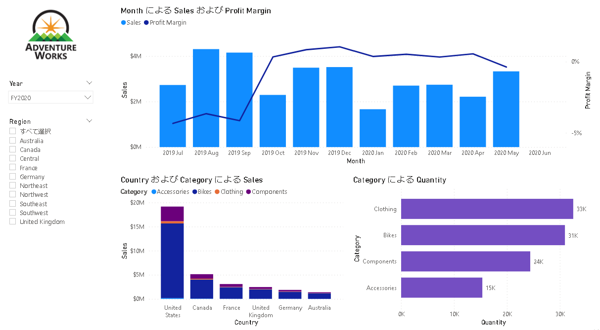

1. Power BI Desktop で、ページの名前を変更するには、左下にある **[Page 1]** を右クリックしてから、そのページを **Overview** という**名前に変更**します。

    *ヒント:ページ名をダブルクリックして名前を変更することも可能です。"*

1. 画像を追加するには、**[挿入]** リボン タブで、**[要素]** グループ内の **[画像]** を選択します。

    

1. **[開く]** ウィンドウで、**D:\PL300\Resources** フォルダーに移動します。

1. **AdventureWorksLogo.jpg** ファイルを選択し、**[開く]** を選択します。

1. 画像をドラッグして左上隅に配置し、ガイド マーカーをドラッグしてサイズを変更します。

     

1. スライサーを追加するには、まずレポート ページの空の領域をクリックして画像を選び、 **[視覚化]** ペインで **[スライサー]** を選択します。

     

1. **[データ]** ペインで、**Date\| Year** フィールド (階層の **Year** レベルではありません) を [視覚化] ペインのスライサー **[フィールド]** にドラッグします。
   
1. スライサーをリストからドロップダウンに変換するには、 **[視覚化] > [ビジュアルの書式設定] > [ビジュアル] > [スライサーの設定] > [スタイル]** の順に移動し、ドロップダウン メニューから **[ドロップダウン]** を選択します。

    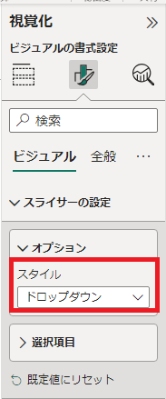

1. イメージの下に配置され、イメージと同じ幅になるようにスライサーのサイズと位置を変更します。

     

1. **Year** スライサーで、ドロップダウン リストを開き、**FY2020** を選択してドロップダウン リストを折りたたみます。
    1. "レポート ページは、**FY2020** 年でフィルター処理されるようになりました。"**

     

1. レポート ページの空いている領域をクリックして、スライサーの選択を解除します。

1. **Region \| Region** フィールドを基にして、2つ目のスライサーを作成します (階層の **Region** レベルではありません)。

1. スライサーをリストのままにして、スライサーのサイズを変更し、配置します。

     

1. レポート ページの空いている領域をクリックして、スライサーの選択を解除します。

1. ページにグラフを追加するには、**[視覚化]** ペインで、**[折れ線グラフおよび積み上げ縦棒グラフ]** 視覚化の種類を選択します。

     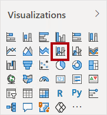

1. ビジュアルをロゴの右側に配置し、レポート ページの幅と等しくなるようにサイズを変更します。

     

1. 次のフィールドをビジュアルにドラッグ アンド ドロップします。

     - Date \| Month
     - Sales \| Sales

1. ビジュアル フィールド ペイン ( **[視覚化]** ペインの下部) で、フィールドが **[X 軸]** および **[列の Y 軸]** 領域に割り当てられていることが確認できます。
   
    "フィールドをビジュアルにドラッグすると、既定の領域に追加されます。領域を指定して配置したい場合は、次のようにフィールドを領域に直接ドラッグできます。"

     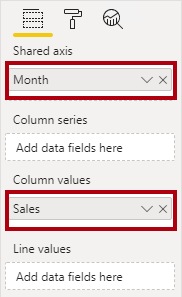

1. **[データ]** ペインから、**Sales \| Profit Margin** フィールドを **[線の Y 軸]** ウェル/領域にドラッグします。

     

1. グラフ上は11 か月分の結果しか表示されていませんが、これは1 年の最後の月である 2020 年 6 月は、売上がまだ計上されていないことに起因します。既定では、数値のない月はビジュアル上から除去されています。以降の手順で、すべての月が表示されるようにビジュアルを構成します。
   
1. ビジュアル フィールド ペインの **[X 軸]** ウェル/領域で、 **[Month]** フィールドの下向き矢印を選択し、 **[データのないアイテムを表示]** を選びます。
   
    ''**2020 June** の月が表示されるようになったことに注目してください。''**

     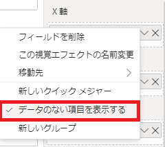

1. レポート ページの空いている領域をクリックして、グラフの選択を解除します。

1. ページにグラフを追加するには、 **[視覚化]** ペインで、 **[積み上げ縦棒グラフ]** という視覚化の種類を選択します。

     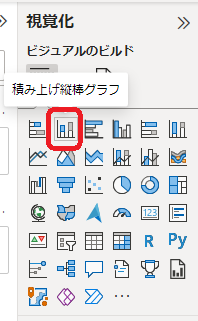

1. ビジュアルのサイズを変更して縦棒/折れ線グラフの下に配置し、上のグラフの幅の半分になるようにします。

     

1. 次のフィールドをビジュアル x領域に追加します。

     - X 軸: **Region \| Country**
     - Y 軸: **Sales \| Sales**
     - 凡例: **Product \| Category**

1. レポート ページの空いている領域をクリックして、グラフの選択を解除します。

1. ページにグラフを追加するには、**[視覚化]** ペインで、**[積み上げ横棒グラフ]** 視覚化の種類をクリックします。

     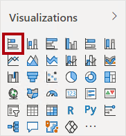

1. ビジュアルのサイズを変更し、残りのレポート ページ領域を埋めるように配置します。

     

1. 次のフィールドをビジュアル ウェル/領域に追加します。

     - Y 軸: **Product \| Category**
     - X 軸: **Sales \| Quantity**

1. 視覚化の書式を設定するには、**[書式]** ペインを開きます。

1. **[バー]** 、 **[色]** グループの順に展開し、 **[既定の色]** プロパティを適切な色に設定します (縦棒グラフや折れ線グラフを補完する色)。

1. **[データ ラベル]** プロパティを **[オン]** に設定します。

     

1. Power BI Desktop ファイルを保存します。

*最初のページのデザインが完了しました。*

## **ページ 2 をデザインする**

このタスクでは、2つ目のレポート ページをデザインします。 設計が完了すると、ページは次のようになります。

 

1. 新しいページを作成するには、左下にあるプラス記号アイコンを選択し、新しいページの名前を **Profit** に変更します。

1. **Region \| Region** フィールドに基づくスライサーを追加します。

1. **[書式]** ペインを使用して、[すべて選択] オプションを有効にします ( **[選択]** グループ)。

1. スライサーのサイズを変更してレポート ページの左側に配置し、ページの高さの約半分になるようにします。

     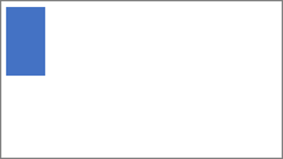

1. マトリックス ビジュアルを追加し、サイズを変更して配置して、レポート ページの残りの領域を埋めます

     

1. **Date \| Fiscal** 階層を、マトリックスの **[行]** 領域に追加します。

     

1. 次の 5 つの **Sales** テーブル フィールドを **[値]** 領域に追加します。

     - Orders (**Counts** フォルダーから)
     - Sales
     - Cost
     - Profit
     - 利益率

     

1. **[フィルター]** ウィンドウ (**[視覚化]** ウィンドウの左側) で、**[このページでのフィルター]** 領域を確認します。

     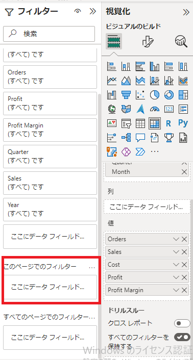

1. **[データ]** ペインから **Product \| Category** フィールドを **[このページでのフィルター]** ウェル/領域にドラッグします。
   
    " **[フィルター]** ペインにフィールドを追加すると、スライサーと同じ結果を得ることができます。*1 つの違いは、レポート ページのスペースを取らない点です。もう 1 つの違いは、より洗練されたフィルター処理要件を達成するように構成できることです。"*

1. フィルター カード内の上矢印を選択して、カードを折りたたみます。

1. **[カテゴリ]** カード直下で、**[このページでのフィルター]** ウェル/領域に次の各 **Product** テーブル フィールドを追加して、それぞれを折りたたみます。

     - Subcategory
     - Product
     - Color

     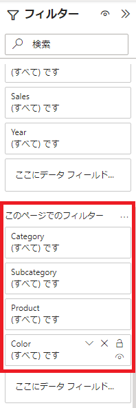

1. Power BI Desktop ファイルを保存します。

 *2 つ目のページのデザインが完了しました。*

## **ページ 3 をデザインする**

このタスクでは、3つ目のレポート ページをデザインします。 設計が完了すると、ページは次のようになります。

 

1. 新しいページを作成し、名前を **"My Performance"** に変更します。

1. **Salesperson (Performance) \| Salesperson** フィールドを、[フィルター] ペインの [このページでのフィルター] にドラッグします。

     

1. **[Michael Blythe]** を選択します。 **[My Performance]** レポート ページの日付は、Michael Blythe のみのデータを表示するためにフィルター処理されています。

1. **Date \| Year** フィールドに基づくドロップダウン スライサーを追加し、サイズと位置を変更してページの左上隅に配置します。

     

1. スライサーで、**FY2019** によってフィルター処理するようにページを設定します。

     

1. **[複数の行カード]** 視覚化を追加し、スライサーの右側でページの残りの幅を埋めるようにサイズと位置を変更します。

     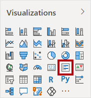

     

1. 視覚化に次の 4 つのフィールドを追加します。

     - Sales \| Sales
     - Targets \| Target
     - Targets \| Variance
     - Targets \| Variance Margin

1. 視覚化の書式を設定します。

     - ビジュアルの書式設定から、**[吹き出しの値]** グループで **[テキスト サイズ]** プロパティを **28 pt** に増やします

     - **[全般] > [効果] > [背景]** グループで、 **[色]** を薄い灰色 ("白、20% 暗い" など) に設定して、コントラストを指定します

         

1. **集合横棒グラフ** ビジュアルを追加し、複数行カード ビジュアルの下に位置し、ページの残りの高さと、複数行カード ビジュアルの幅の半分になるようにサイズを変更します。

     

     

1. 次のフィールドをビジュアル ウェル/領域に追加します。

     - Y 軸: **Date \| Month**
     - X 軸: **Sales \| Sales** および **Targets \| Target**

         

1. 視覚化のコピーを作成するには、**Ctrl + C** キーを押してから、**Ctrl + V** キーを押します。

1. 新しいビジュアルを元のビジュアルの右側に配置します。

     

1. 視覚エフェクトの種類を変更するには、**[視覚化]** ペインで **[集合縦棒グラフ]** を選択します。

     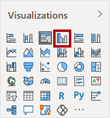

 "同じデータを 2 つの異なる視覚化の種類で表したものを見ることができるようになりました。これはページ レイアウトの使い方としてはあまりよくありませんが、「**Power BI Desktop でレポートを強化する**」ラボでは、ビジュアルを重ね合わせることで改善します。ページにボタンを追加して、2 つのビジュアルのどちらを表示するかをレポートのユーザーが決定できるようにします。"**

 *3 番目 (最後) のページのデザインが完了しました。*

## **レポートを発行する**

このタスクでは、レポートを Power BI サービスに発行します。

1. **[Overview]** ページを選択してから、Power BI Desktop ファイルを保存します。

1. **[ホーム]** リボン タブで、**[共有]** グループの **[発行]** を選択します。
   
    ''まだ Power BI Desktop にサインインしていない場合は、サインインして発行する必要があります。''

    Skillableを使用してラボを実行している場合は、ラボウィンドウ右側のリソースタブに表示されているアカウント情報を使用し、組織アカウントとしてサインインしてください。

1. **[Power BI に発行]** ウィンドウで、**[マイ ワークスペース]** が選択されていることを確認します。
   
    ''このラボでは、Power BI サービス内のさまざまな項目については詳しく説明しません。

1. レポートを発行するには、 **[選択]** を選びます。 これには数分かかることがあります。 
1. 発行が成功したら、**[了解]** を選択します。

## **レポートを確認する**

このタスクでは、Power BI に発行されたレポートを確認します。

1. Microsoft Edge ブラウザーを開いてから、 **https://app.powerbi.com** でサインインします（仮想マシン上のEdgeではブックマークされています）。

1. Microsoft Edge ブラウザー ウィンドウの Power BI サービスで画面左側の **[ナビゲーション]** ウィンドウから、**[My workspace]** を展開します。

1. ワークスペースのコンテンツを確認します。
    1. ''ワークスペースに存在できる項目は 4 種類あります。ここでは、**レポート**と**データセット**について説明します。''
    1. ''データセットが表示されない場合は、Microsoft Edge ブラウザーを最新の情報に更新する必要がある場合があります。''
    1. *Power BI Desktop ファイルを発行したときに、データ モデルはデータセットとして発行されました。*

1. レポートを確認するには、 **[Sales Analysis]** レポートを選択します。

1. 左側の **[ページ]** ウィンドウで、**[Overview]** ページを選択します。

1. **Regions** スライサーで、**Ctrl** キーを押しながら複数の地域を選択します。

1. 縦棒と折れ線のグラフで、任意の月の列を選択して、ページをクロスフィルター処理します。

1. **Ctrl** キーを押しながら、別の月を選択します。

     ''注: 既定では、クロスフィルター処理によってページ上の他のすべてのビジュアルがフィルター処理されます。''

1. 横棒グラフがフィルター処理されて強調表示されており、横棒の太字部分がフィルター処理された月を表していることを確認してください。

1. 棒グラフ ビジュアルの上にカーソルを置き、右上のフィルター アイコンにカーソルを合わせます。 

    *フィルター アイコンを使用すると、他の視覚化からのスライサーとクロスフィルターも含めて、視覚化に適用されているすべてのフィルターがわかります。*

1. 横棒をポイントし、ヒントの情報を確認します。

1. クロスフィルターを取り消すには、縦棒と折れ線のグラフで、視覚化の空いている領域を選択します。

1. 積み上げ縦棒グラフのビジュアルをポイントしてから、右上にある **[フォーカス モード]** アイコンを選択します。

     *フォーカス設定モードでは、視覚化が全ページ サイズに拡大されます。*

1. 棒グラフの別のセグメントにカーソルを合わせると、ヒントが表示されます。

1. レポートのページに戻るには、左上にある **[レポートに戻る]** を選択します。

      

1. もう一度ビジュアルの 1 つをポイントし、右上にある省略記号 (...) を選択して、メニュー オプションに注目します。 **[Chat in Teams](Teams でチャット)** 以外のオプションを 1 つずつ試します。

      

1. 左側の **[ページ]** ペインで、**Profit** ページを選択します。

      

1. **Region** スライサーは、**[概要]** ページの **[Region]** スライサーとは異なる選択を行うことに注目してください。

     "スライサーは同期されていません。「**Power BI Desktop でレポートを強化する**」ラボで、レポートのデザインを変更し、ページ間で確実に同期されるようにします。"

1. **[フィルター]** ペイン (右側にあります) でフィルター カードを展開し、フィルターをいくつか適用します。

     " **[フィルター]** ペインでは、スライサーとしてページに収まりきらない可能性があるほど多くのフィルターを定義できます。"**

1. マトリックス視覚化で、プラス (+) ボタンを使用して **Fiscal** 階層の詳細を表示します。

1. **My Performance** ページを選択します。

      

1. メニュー バーの右上にある **[表示]** を選択して、**[Fullscreen]** （全画面）を選択します。

      

1. スライサーを変更し、ページをクロスフィルター処理して、ページを操作します。

1. ウィンドウの最下部には、ページの変更、ページ間での前後への移動、または全画面表示モードを終了するためのコマンドがあります。

1. 右側のアイコンを選択して、全画面表示モードを終了します。

      

### **仕上げ**

このタスクでは、ラボを完了します。

[My workspace] に戻るには、ウィンドウの Web ページのバナーで **[My workspace]** を選択します。

 ''「**Power BI Desktop でレポートを強化する**」ラボでは、高度な機能を使用してレポートのデザインを強化します。''**
