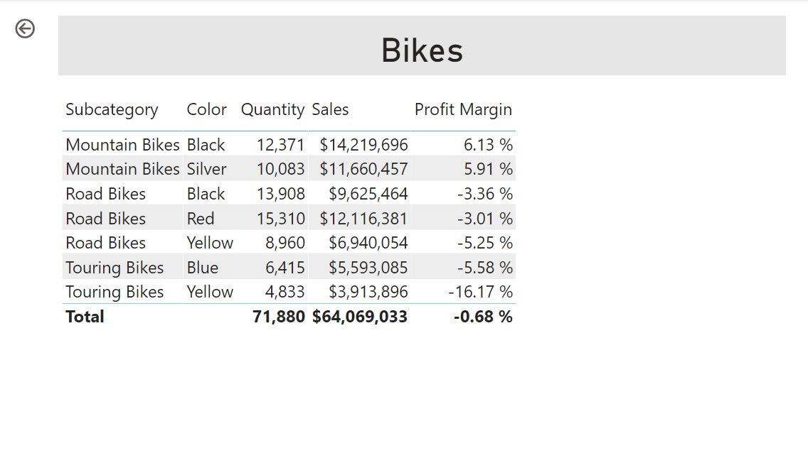
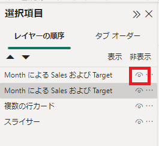
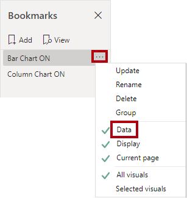

---
lab:
  title: Power BI Desktop でレポートを強化する
  module: Create Reports in Power BI desktop
---

# Power BI Desktop でレポートを強化する

## **ラボのストーリー**

このラボでは、高度なデザイン機能を使用して **Sales Analysis** を強化します。

このラボでは、次の作業を行う方法について説明します。

- スライサーを同期する
- ドリルスルー ページを作成する
- 条件付き書式の適用
- ブックマークの作成と使用

**このラボの実施には約45分かかります。**

## **開始する – サインイン**

このタスクでは、Power BI にサインインして、ラボの環境を設定します。

*注: Power BI に既にサインインしている場合は、次のタスクに進みます。*

1. Microsoft Edge を開くには、タスク バーにある Microsoft Edge プログラム ショートカットを選択します。

     

1. Microsoft Edge ブラウザー ウィンドウで、**https://app.powerbi.com** に移動します。

1. 組織の資格情報 (Skillableを使用している場合はリソースタブに記載の資格情報) を使用して、サインインします。 Microsoft Edge からサインインを維持するように求められた場合は、**[はい]** を選択します。

1. Microsoft Edge ブラウザー ウィンドウの Power BI サービスの **[ナビゲーション]** ペインで、**[My workspace]** を展開します。 Microsoft Edge ブラウザー ウィンドウを開いたままにします。

## **開始する – レポートを開く**

このタスクでは、スタート レポートを開いてラボの環境を設定します。

''前のラボから続行している場合は、そのまま次のタスクに進んでください。''

1. Power BI Desktop を開きます。

    

1. スターター Power BI Desktop ファイルを開くには、 **[ファイル] > [レポートを開く] > [レポートの参照]** の順に選択します。

1. **[開く]** ウィンドウで、**D:\PL300\Labs\07-design-report-in-power-bi-desktop-enhanced\Starter** フォルダーに移動し、**Sales Analysis** ファイルを開きます。

1. 情報ウィンドウが開いている場合はすべて閉じます。

1. リボンの下の黄色の警告メッセージに注目してください。

    "このメッセージは、クエリが、モデル テーブルとしての読み込みに適用されていないことを警告しています。クエリは、このラボの後半で適用します。"

    "警告メッセージを無視するには、黄色の警告メッセージの右側にある **[X]** を選択します。"

1. ファイルのコピーを作成するには、 **[ファイル] > [名前を付けて保存]** の順に移動し、**D:\PL300\MySolution** フォルダーに保存します。

1. 変更の適用を求めるメッセージが表示されたら、**[後で適用]** を選択します。

## **スライサーを同期する**

このタスクでは、**Year** と **Region** スライサーをページ間で同期し、「**Power BI Desktop でレポートをデザインする**」ラボで作成したレポートを改良していきます。

1. Power BI Desktop の **[Overview]** ページで、**[Year]** スライサーを **FY2018**に設定します。

1. **[My Performance]** ページに移動すると、**[Year]** スライサーの値が異なっていることがわかります。

    "スライサーがページ間で同期されていないと、求めているデータが表示されず、レポート ユーザーのフラストレーションにつながる可能性があります。以降の手順で、レポート スライサーの同期を設定します。"

1. **[Overview]** ページに戻り、**[Year]** スライサーを選択します。

1. **[表示]** リボン タブの **[ペインを表示する]** グループ内の **[スライサーの同期]** を選択します。

     

1. **[スライサーの同期]** ペインで、**[Overview]** ページと **[My Performance]** ページのチェックボックスをオンにします。

     

1. **[Overview]** ページで、**[Region]** スライサーを選択します。

1. スライサーを **[Overview]** ページおよび **[Profit]** ページのチェックボックスをオンにして同期させます。

1. スライサーの選択肢を変更してからページの移動を行い、同期されたスライサーが同じ選択でフィルター処理されることを確認します。

1. **[スライサーの同期]** ページを閉じるには、ペインの右上にある **[X]** を選択します。

## **ドリルスルーを構成する**

この演習では、新しいページを作成し、ドリルスルー ページとして構成します。 設計が完了すると、ページは次のようになります。

## **ドリルスルー ページを作成する**

このタスクでは、新しいページを作成し、ドリルスルー ページとして構成します。

1. **"Product Details"** という名前の新しいレポート ページを追加します。

1. **[Product Details]** ページ タブを右クリックし、**[ページを非表示にする]** を選択します。

    "レポート ユーザーのドリルスルー ページへの直接アクセスを制限しています。*他のページのビジュアルからアクセスする必要があります。"*

1. **[視覚化]** ペインの下にある **[ドリルスルー]** セクションで、**Product \| Category** フィールドを **[ドリルスルー フィールドをここに追加します]** ボックスに追加します。

    

     

1. ドリルスルー ページをテストするには、ドリルスルー フィルター カードで **[Bikes]** を選択します。

     

1. レポート ページの左上に矢印ボタンが出現します。

    "フィールドがドリル スルー領域に追加されると、矢印ボタンが自動的に追加されます。これを使うと、レポート ユーザーがドリルスルー元のページに戻ることができます。"**

1. ページに**カード** ビジュアルを追加し、サイズを変更して、ボタンの右側に配置し、ページの残りの幅を埋めるようにします。

    

    

1. カードのビジュアルに **Product \| Category** フィールドをドラッグします。

1. 視覚化の書式オプションを構成してから、**[ビジュアル]>[カテゴリ ラベル]** プロパティを **[オフ]** にします。

1. **[全般]>[効果] > [背景色]** プロパティを、''白、20% 暗い'' などの灰色の薄い網掛けに設定します。**

1. ページに **[テーブル]** ビジュアルを追加し、サイズを変更して、カード ビジュアルの下に配置し、ページ上の残りの領域を埋めます。

     

     

1. 視覚化に次のフィールドを追加します。

     - Product \| Subcategory
     - Product \| Color
     - Sales \| Quantity
     - Sales \| Sales
     - Sales \| Profit Margin

1. ビジュアルの書式オプションを構成し、 **[値]** セクションで、 **[文字のサイズ]** プロパティを **[20pt]** に設定します。

"ドリル スルー ページの基本的な設計は完了しました。*次の演習では、条件付き書式を使用してページを拡張します。"*

## **条件付き書式を追加する**

この演習では、条件付き書式を使用してドリル スルー ページを拡張します。 設計が完了すると、ページは次のようになります。

## **条件付き書式を追加する**

このタスクでは、条件付き書式を使用してドリル スルー ページを拡張します。

1. テーブルビジュアルを選択します。 [視覚化] ペインで、 **[Profit Margin]** 値の上の下矢印を選択してから、 **[条件付き書式] \| [アイコン]** を選びます。

    

1. **[アイコン - Profit Margin]** ウィンドウの **[アイコン レイアウト]** ドロップダウン リストで、**[データの右側]** を選択します。

     

1. 中央のルールを削除するには、黄色の三角形の右側にある **[X]** を選択します。

1. 次のように、最初のルール (赤色のひし形) を構成します。

    - 2 つ目のコントロールで値を削除します
    - 3 つ目のコントロールで **[番号]** を選択します
    - 5 つ目のコントロールに「**0**」と入力します
    - 6 つ目のコントロールで **[番号]** を選択します

1. 次のように、2 つ目のルール (緑色の円) を構成してから、 **[OK]** を選択します。

    "ルールは次のように解釈できます。利益率の値が 0 未満の場合は赤いひし形を表示します。それ以外の場合は、値が 0 以上の場合は、緑の円を表示します。"**

     - 2 つ目のコントロールに「**0**」と入力します
     - 3 つ目のコントロールで **[番号]** を選択します
     - 5 つ目のコントロールで値を削除します
     - 6 つ目のコントロールで **[番号]** を選択します

     

1. テーブル視覚化で、正しいアイコンが表示されていることを確認します。

     

1. **[Color]** フィールドの背景色の条件付き書式を構成します。

     

1. **[背景色 -- 色]** ウィンドウの **[書式設定スタイル]** ドロップダウン リストで、 **[フィールド値]** を選択します。

1. **[基準にするフィールド]** ドロップダウン リストで、 **[Product] \| [Formatting] \| [Background Color Format]** を選んでから、 **[OK]** を選択します。

     

1. 前の手順を繰り返し、**Product \| Formatting \| Font Color Format** フィールドを使用して、 **[Color]** フィールドのフォント色の条件付き書式を設定します

## **ブックマークとボタンを追加する**

この演習では、 **[My Performance]** ページをボタンを使用して拡張し、レポート ユーザーが表示する視覚化の種類を選択できるようにします。 設計が完了すると、ページは次のようになります。

## **ブックマークを追加する**

このタスクでは、2 つのブックマークを追加します。1 つは、毎月の売上と目標の各視覚化を表示するためのものです。

1. **[My Performance]** ページに移動します。 **[表示]** リボン タブの **[ペインを表示する]** グループ内の **[ブックマーク]** を選択します。

     

1. **[表示]** リボン タブの **[ペインを表示する]** グループ内の **[選択項目]** を選択します。

1. **[選択項目]** ペインで、最上位にある**[MonthにおけるSales および Target]** 項目の横にある目のアイコンを選択して視覚化を非表示にします。

     

1. **[ブックマーク]** ペインで、**[追加]** を選択します。

    *ブックマークの名前を変更するには、ブックマークをダブルクリックします。*

1. 表示されているグラフが横棒グラフの場合は、ブックマークの名前を **[Bar Chart ON]** に変更します。それ以外の場合は、ブックマークの名前を **[Column Chart ON]** に変更します。

1. ブックマークを編集するには、 **[ブックマーク]** ペインでブックマークにカーソルを合わせて省略記号を選んでから **[データ]** を選択します。

     " **[データ]** オプションを無効にすると、ブックマークで現在のフィルターの状態が使用されなくなります。*これが重要である理由は、そのようにしないと、現在 **[Year]** スライサーによって適用されているフィルターがブックマークによって永久にロックされるからです。"*

     

1. ブックマークを更新するには、省略記号をもう一度選んでから **[更新]** を選択します。

     *次の手順では、2 つ目のブックマークを作成および構成して、2 つ目の視覚化を表示します。*

1. **[選択項目]** ペインで、2 つの **[MonthにおけるSales および Target]** 項目の表示を切り替えます。

     *表示されている視覚化を非表示にし、非表示の視覚化を表示します。*

     

1. 2 つ目のブックマークを作成し、先ほどと同様に**[Column Chart ON]** または **[Bar Chart ON]**のどちらかに表示されているグラフ形状に合わせて名称を変更します。

     

1. 2 つ目のブックマークを構成してフィルターを無視し (**[データ]** オプションをオフ)、ブックマークを更新します。

1. **[選択項目]** ウィンドウで両方のビジュアルを表示するには、非表示のビジュアルを表示するだけです。

1. 両方の視覚化のサイズと位置を変更して、マルチカード視覚化の下のページ全体に表示し、互いに完全に重なり合うようにします。

     ''隠れている視覚化を選ぶ場合は、 **[選択項目]** ペインで選びます。''

     

1. **[ブックマーク]** ペインで各ブックマークを選択します。1 つの視覚化のみが表示されることに注目してください。

*デザインの次の段階は、ページに 2 つのボタンを追加することです。これで、レポート ユーザーはブックマークを選択できるようになります。*

## **ボタンを追加する**

このタスクでは、2 つのボタンを追加し、それぞれにブックマーク アクションを割り当てます。

1. **[挿入]** リボンの **[要素]** グループ内の **[ボタン]** を選択し、**[空白]** を選択します。

1. **Year** スライサーの真下にボタンを配置します。

1. ボタンを選択し、 **[ボタンの書式設定]** ペインで、 **[ボタン]** を選び、 **[スタイル]** セクションを展開し、 **[テキスト]** プロパティを **[オン]** にします。

1. **[テキスト]** セクションを展開し、 **[テキスト]** ボックスに「**Bar Chart**」と入力します。

1. **[塗りつぶし]** セクションを展開してから、補完的な色を使用して塗りつぶしの色を設定します。

1. **[ボタン]** を選択し、 **[アクション]** プロパティを **[オン]** にします。

    

1. **[アクション]** セクションを展開し、**[型]** ドロップダウン リストを **[ブックマーク]** に設定します。

1. **[ブックマーク]** ドロップダウン リストで、**[Bar Chart ON](横棒グラフ オン)** を選択します。

    

1. コピーと貼り付けを使用してボタンのコピーを作成し、次のように新しいボタンを構成します。

    *ヒント:コピーと貼り付けのショートカット コマンドは、**Ctrl+C** キーに続いて **Ctrl+V** キーです。"*

    - **[ボタン テキスト]** プロパティを **[縦棒グラフ]** に設定します
    - **[アクション]** セクションで、**[ブックマーク]** ドロップダウン リストを **[Column Chart ON](横棒グラフ オン)** に設定します

*これで、Sales Analysis レポートのデザインが完成しました。*

## **レポートを発行する**

このタスクでは、レポートを発行します。

1. **[Overview]** ページを選択します。

1. **[Year]** スライサーで、**[FY2020]** を選択します。

1. **[Region]** スライサーで、**[すべて選択]** を選択します。

1. Power BI Desktop ファイルを保存します。

    *Power BI サービスに発行する前に必ず、ファイルを保存する必要があります。*

1. **[ホーム]** リボン タブで、**[共有]** グループの **[発行]** を選択します。

     

1. **[Power BI に発行]** ウィンドウで、**[My Workspace]** が選択されていることを確認します。

1. レポートを発行するには、 **[選択]** を選びます。
    1. データセットの置換を求めるメッセージが表示されたら、**[置換]** を選択します。
    1. 発行が成功したら、**[了解]** を選択します。

1. Power BI Desktop を閉じます。

*次の演習では、Power BI サービスでレポートを探索します。*

## **レポートを探索する**

このタスクでは、Power BI サービスでレポートを探索します。

1. Microsoft Edge ブラウザー ウィンドウで、Power BI サービス > **[マイ ワークスペース]** の順に移動してから、 **[Sales Analysis]** レポートを選択します。

1. ドリルスルー機能をテストするには、 **[Overview]** ページ > **[CategoryによるQuantity]** 視覚化の順に移動します。 その後、 **[Clothing]** バーを右クリックし、 **[ドリルスルー] \| [Product Detail]** を選択します。

     

1. **[Product Detail]** ページが **[Clothing](衣類)** 用であることに注目してください。

1. ソース ページに戻るには、ページの左上隅の矢印ボタンを選択します。

1. **My Performance** ページを選択します。

    *各ボタンを選択すると、別の視覚化が表示されることに注目してください。*

### **仕上げ**

このタスクでは、ラボを完了します。

ワークスペースに戻るには、ウィンドウの Web ページのバナーで、 **[My workspace]** を選択します。

