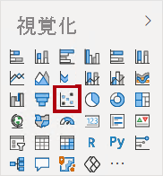
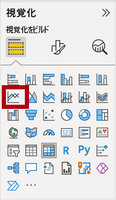
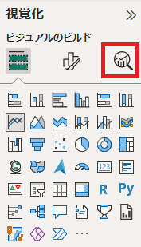
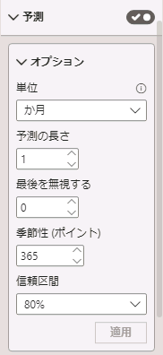

---
lab:
  title: AI 視覚化を使って高度な分析を実行する
  module: Perform Data Analysis in Power BI
---


# **Power BI でデータ分析を実行する**

## **ラボのストーリー**

このラボでは、**Sales Exploration** レポートを作成します。

このラボでは、次の作業を行う方法について説明します。

- アニメーション化した散布図の作成
- ビジュアルを使用した値の予測

**このラボの実施には約35分かかります。**

## **開始するには**

1. この演習を完了するには、まず Web ブラウザーを開き、次の URL を入力して zip フォルダーをダウンロードします。

     ```
     https://github.com/MicrosoftLearning/PL-300-Microsoft-Power-BI-Data-Analyst/raw/Main/Allfiles/Labs/10-perform-analytics-power-bi/10-perform-analytics.zip
     ```

     フォルダーを **C:\Users\ctct\Downloads\10-perform-analytics** フォルダーに展開します。

     1. **10-Starter-Sales Analysis.pbix** ファイルを開きます。

     > ***注**: **[キャンセル]** を選択すると、サインインを閉じることができます。 他のすべての情報ウィンドウを閉じます。 変更の適用を求めるメッセージが表示されたら、**[後で適用]** を選択します。


## **開始する – セマンティックモデルの作成**

このタスクでは、セマンティックモデルを作成してラボの環境を設定します。 ''セマンティックモデルを既に発行している場合は、次のタスクに進んでください。''

1. Microsoft Edge ブラウザー ウィンドウで、Power BI サービスの **[マイワークスペース]** に移動します。

1. **[インポート] > [レポート～] > [コンピューターから]** の順に選択します。

1. **C:\Users\ctct\Downloads\10-perform-analysis** フォルダーに移動します。

1. **10-Starter-Sales Analysis.pbix** ファイルを選択し、**[開く]** を選択します。

    ''セマンティックモデルの置換を求めるメッセージが表示されたら、 **[置換]** を選択します。''

''この演習では、このセマンティックモデルを使用して新しいレポートを作成します。このプロセスは、新しくアップロードするのではなく、別のレポートの既存のセマンティックモデルで実行できます。また、レポートを使用していない場合は、不要なものを削除することをお勧めします。''

## **レポートを作成する**

このタスクでは、前回のタスクで作成した Power BI セマンティックモデルへのライブ接続を作成し、新しい **Sales Exploration** レポートを作成します。

1. Power BI Desktop を新規に開きます。

    > 既にPower BI Desktopのウィンドウを開いている場合は、以下の方法で新規のウィンドウを起動可能です。
    >
    > ・デスクトップに配置されているショートカットをダブルクリック
    >
    > ・タスクバーのアイコンを右クリックしてPower BI Desktopをクリック
    >
    > ・Power BIDesktopのリボンメニューのファイルを選択して「空のレポート」をクリック

    

1. [ホーム] リボンで、 **[データの取得] > [Power BI セマンティックモデル]** の順に選択します。

1. **[OneLake カタログ]** ウィンドウの **[マイ ワークスペース]** の **10-Starter-Sales Analysis** セマンティックモデルを選んでから、 **[接続]** を選択するか、ダブルクリックしてセマンティックモデルを読み込みます。

1. **[ファイル] > [保存]** の順に移動し、ファイルに **Sales Exploration** という名前を付けて **C:\Users\ctct\Documents** フォルダーに保存します。

*次に、2 つのレポート ページを作成し、各ページで異なるビジュアルを操作して、データの分析および調査を行います。*

## **アニメーション化した散布図を作成する**

このタスクでは、アニメーション化できる散布図を作成します。

1. **ページ 1** の名前を**散布図**に変更します。

1. レポート ページに**散布図**ビジュアルを追加してから、ページ全体に表示されるように再配置およびサイズ変更します。
   
    " **[再生軸]** 領域にフィールドを追加すると、チャートをアニメーション化できます。"

     

     

1. 次のフィールドをビジュアル領域に追加します。
   
     - X 軸: **Sales \| Sales**
     - Y 軸: **Sales \| Profit Margin**
     - 凡例: **Reseller \| Business Type**
     - サイズ:**Sales \| Quantity**
     - 再生軸: **Date \| Quarter**
    
1. **[フィルター]** ペインで、**Product \| Category** フィールドを **[このページでのフィルター]** ウェルまたは領域に追加します。

1. フィルター カードで、**Bikes** でフィルター処理します。

1. グラフをアニメーション化するには、左下隅にある **[再生]** を選択します。

    

1. **FY2018 Q1** から **FY2020 Q4** までのアニメーション サイクル全体を確認します。
   
    "散布図では、メジャーの値を同時に把握できます。この場合、注文数量、売上収益、および利益率です。"
    
    "各バブルが、販売店の業種を表します。*バブル サイズの変化は、注文量の増減を反映しています。水平方向の移動は売上の増加または減少を表し、垂直方向の移動は利益率の上昇または低下を表します。"*

1. アニメーションが停止したら、いずれかのバブルを選択すると、時系列での追跡が表示されます。

1. バブルの上にカーソルを合わせると、その時点での、その種類の Reseller のメジャー値を示すヒントが表示されます。

1. **[フィルター]** ペインで、**Clothing** のみでフィルター処理を行うと、結果が異なることが確認できます。

1. Power BI Desktop ファイルを保存します。


## **予測を作成する**

このタスクでは予測を作成して、売上収益の将来の可能性を判断します。

1. 新しいページを追加して、ページの名前を**予測**に変更します。

1. レポート ページに**折れ線グラフ** ビジュアルを追加してから、ページ全体に表示されるように配置してサイズを変更します。

     

     

1. 次のフィールドをビジュアル ウェル/領域に追加します。

     - X 軸: **Date \| Date**
     - Y 軸: **Sales \| Sales**

1. **[フィルター]** ペインで、**Date \| Year** フィールドを **[このページでのフィルター]** 領域に追加します。

1. フィルター カードで、**FY2019** および **FY2020** の 2 年でフィルター処理します。
   
    ''タイム ラインで予測する場合は、正確で安定した予測を生成するために、少なくとも 2 サイクルのデータが必要になります。''

1. また、**Product \| Category** フィールドを **[このページでのフィルター]** ウェルまたは領域に追加して、**Bikes** でフィルター処理します。

1. 予測を追加するには、**[視覚化]** ペインから **[分析]** を選択します。

     

8. **[予測]** セクションを展開します。
   
    " **[予測]** セクションが使用できない場合は、ビジュアルが正しく構成されていないことが原因の可能性があります。予測は、軸に date 型のフィールドが 1 つあり、存在する値フィールドは 1 つだけという、2 つの条件が満たされている場合にのみ使用できます。"

1. **[予測]** オプションを **[オン]** にします。

1. 次の予測プロパティを構成してから、 **[適用]** を選択します。

    - 単位: **か月**
    - 予測の長さ: **1 か月**
    - 季節性: **365**
    - 信頼区間: **80%**

    

1. 折れ線ビジュアルで、予測が履歴データを超過して 1 か月延長されていることに注目してください。
   
    "灰色の領域は、信頼度を表します。*信頼度が広いほど安定性が低くなるため、より精度が低くなります。"*
    
    "サイクルの長さ (この例では、年) がわかっている場合は、季節性ポイントを入力する必要があります。*週 (7)、または月 (30) の場合もあります。"*

1. **[フィルター]** ペインで、**Clothing** のみでフィルター処理を行うと、結果が異なることに注意してください。

### **仕上げ**

このタスクでは、Power BI Desktop でラボを完了します。

1. **散布図**ページを選択します。

1. Power BI Desktop ファイルを保存します。

1. ファイルを **[マイ ワークスペース]** に発行するには、 **[ホーム]** リボン タブの **[共有]** グループ内から、 **[発行]** を選択してから、 **[選択]** を選んで発行します。

    

1. Power BI Desktop を閉じます。
