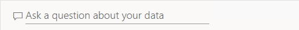
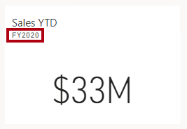

---
lab:
  title: Power BI ダッシュボードを作成する
  module: Create Dashboards
---


# **Power BI ダッシュボードを作成する**

## **ラボのストーリー**

このラボでは、既存のレポートを使用して、Power BI サービスで **Sales Monitoring** ダッシュボードを作成します。

このラボでは、次の作業を行う方法について説明します。

- ダッシュボードに視覚化をピン留め
- Q&A を使用してダッシュボード タイルを作成する

**このラボの実施には約35分かかります。**

## **開始するには**

1. この演習を完了するには、まず Web ブラウザーを開き、次の URL を入力して zip フォルダーをダウンロードします。

     ```
     https://github.com/MicrosoftLearning/PL-300-Microsoft-Power-BI-Data-Analyst/raw/Main/Allfiles/Labs/09-create-power-bi-dashboard/09-create-dashboard.zip
     ```

     フォルダーを **C:\Users\ctct\Downloads\09-create-dashboard** フォルダーに展開します。

## **開始する – レポートの発行**

このタスクでは、セマンティックモデルを作成してラボの環境を設定します。

1. Microsoft Edge ブラウザー ウィンドウで、Power BI サービスの **[マイワークスペース]** に移動します。

1. **[インポート] > [レポート～] > [コンピューターから]** の順に選択します。

1. **C:\Users\Student\Downloads\**09-create-dashboard** フォルダーに移動します。

1. **09-Starter-Sales Analysis.pbix** ファイルを選択し、**[開く]** を選択します。

   ''セマンティックモデルの置換を求めるメッセージが表示されたら、 **[置換]** を選択します。''

''セマンティックモデルの置換を求めるメッセージが表示されたら、 **[置き換える]** を選択します。''

## **ダッシュボードを作成する**

このタスクでは、**Sales Monitoring** ダッシュボードを作成します。 レポートから視覚化をピン留めし、画像データの URI に基づいてタイルを追加し、Q&A を使用してタイルを作成します。

1. Power BI サービスで、**Sales Analysis** レポートを開きます。

1. **[Overview]** ページで、**[Year]** スライサーを **FY2020** に設定します。

    

1. **[Region]** スライサーを **[Select all]** に設定します。

    ''ピン留めされたビジュアルは、ピン留め時にフィルター コンテキストで設定されます。基になるビジュアルが変更された場合は、ダッシュボード タイルも更新する必要があります。時間ベースのフィルターの場合は、相対日付スライサー (または、相対時間ベースの質問を使用した Q&A) を使用することをお勧めします。''

1. ダッシュボードを作成してビジュアルをピン留めするには、 **[Sales and Profit Margin by Month]** (列/行) 視覚化にカーソルを合わせ、プッシュピンを選択します。

    

1. **[Pin to dashboard(ダッシュボードにピン留めする)]** ウィンドウで、 **[Dashboard name]** ボックスに「**Sales Monitoring**」と入力してから、 **[ピン留め]** を選択します。

    

1. **[マイ ワークスペース]** を開き、**Sales Monitoring** ダッシュボードを開きます。

1. ダッシュボードに 1 つのタイルがあることがわかります。

    

1. 質問に基づいてタイルを追加するには、ダッシュボードの左上にある **[Ask a question about your data(データについて質問する)]** を選択します。
   
    "Q&A 機能を使用して質問することができ、Power BI はビジュアルを使用して応答します。"

    

1. Q&A ボックスの下の青色のボックスで、提案された質問のいずれかを選択し、応答を確認します。

1. [Q&A] ボックスからすべてのテキストを削除し、「**Sales YTD**」と入力します

1. **(空白)** と返却されます。
   
    ''「**Power BI Desktop で高度な DAX 計算を作成する**」ラボで **[Sales YTD]** メジャーを追加したことを思い出してください。このメジャーはタイム インテリジェンス式であり、結果を生成するには **[Date]** テーブルにフィルターを適用する必要があります。''**

    

1. 質問を **in year FY2020** (FY2020 年度の) で拡張します。

1. 応答が **$33M** になったことに注意してください。

    

1. 応答をダッシュボードにピン留めするには、右上隅にある **[Pin visual(ビジュアルをピン留めする)]** を選択します。

    

1. ダッシュボードにタイルをピン留めするように求めるメッセージが表示されたら、**[Pin(ピン留めする)]** を選択します。

1. ダッシュボードに戻るには、左上隅にある **[Exit Q&A(Q&amp;A の終了)]** を選択します。

1. 会社のロゴを追加するには、メニュー バーの **[Edit(編集)]** を選択してから、 **[Add a tile(タイルの追加)]** を選びます。
   
    ''この手法を使用してダッシュボード タイルを追加すると、Web コンテンツ、画像、リッチな書式設定のテキスト ボックス、ビデオ (YouTubeリンクを使用) などのメディアを使ってダッシュボードを強化できます。’

1. (右側にある) **[タイルの追加]** ペインで、 **[image(画像)]** タイルを選んでから、 **[Next]** 選択します。

1. **[画像タイルの追加]** ペインの **[URL]** ボックスに、**C:\Users\ctct\Downloads\09-create-dashboard\AdventureWorksLogo_DataURL.txt** ファイルにある完全な URL を入力してから、 **[適用]** を選択します。
   
    *その URL を使用して画像を埋め込むことも、データ URL を使用してコンテンツをインラインで埋め込むこともできます。*

1. ロゴ タイルのサイズを変更するには、右下隅をドラッグし、タイルのサイズを 1 単位の幅、2 単位の高さに変更します。
   
    ''タイルのサイズは、長方形に制限されます。''**

1. ロゴが左上に、**[Sales YTD]** タイルがその下に、**[Sales, Profit Margin]** タイルが右側に表示されるようにタイルを整頓します。

    

## **タイルの詳細を編集する**

このタスクでは、2 つのタイルの詳細を編集します。

1. **[Sales YTD]** タイルにカーソルを合わせ、タイルの右上にある省略記号を選択してから、**[詳細の編集]** を選択します。

    

1. (右側にある) **[タイルの詳細]** ペインで、 **[サブタイトル]** ボックスに「**FY2020**」と入力してから、 **[適用]** を選択します。

1. **[Sales YTD]** タイルにサブタイトルが表示されていることに注意してください。

    

1. **[Sales, Profit Margin]** タイルのタイル詳細を編集します。

1. **[タイルの詳細]** ペインの **[Functionality(機能)]** セクションで、 **[Display last refresh time(最終更新日時の表示)]** をオンにしてから、 **[Apply(適用)]** を選択します。

    

1. タイルに最終更新日時 (Power BI Desktop でデータ モデルを読み込むときに行ったもの) が表示されていることに注意してください。

''次の演習では、セマンティックモデルを更新します。データとレポートに応じて、いつでもアドホック データ更新を実行したり、スケジュールを設定したりできます。しかし、スケジュールされた更新には、このラボ用に構成できないゲートウェイが必要です。そのため、Power BI Desktop から手動でデータ更新を実行し、ファイルをワークスペースにアップロードします。''

## **セマンティックモデルを最新の情報に更新する**

この演習では、最初に 2020 年 6 月の販売注文データを **AdventureWorksDW2020** データベースに読み込みます。 次に、Power BI Desktop ファイルを開き、データ更新を実行し、ワークスペースにファイルをアップロードします。

## **ラボ データベースを更新する**

このタスクでは、PowerShell スクリプトを実行して、**AdventureWorksDW2020** データベース内のデータを更新します。

1. エクスプローラーで、**D:\Allfiles\Setup** フォルダー内の **UpdateDatabase-2-AddSales.ps1** ファイルを右クリックし、 **[PowerShell で実行]** を選択します。

    

1. 実行ポリシーを変更するよう求められた場合は、**A** キーを押します。

1. キーを押して閉じるように求められたら、**Enter** をもう一度押します。

"**AdventureWorksDW2020** データベースに、2020 年 6 月に行われた販売注文が含まれるようになりました。"**

## **Power BI Desktop ファイルを最新の情報に更新する**

このタスクでは、**Sales Analysis** Power BI Desktop ファイルを開き、データ更新を実行して、そのファイルを **Sales Analysis** ワークスペースにアップロードします。

1. Power BI Desktopの **[データ]** ペインで、**Sales** テーブルを右クリックして **[データの更新]** を選択します。

    クエリの適用を求められた場合は、"変更を破棄"してから再度実施してください。

1. 更新が完了したら、Power BI Desktop ファイルを保存します。

1. ファイルをワークスペースに発行するには、 **[ホーム]** リボン タブの **[共有]** グループ内から、 **[発行]** を選択し、 **[選択]** を選んで発行します。

1. セマンティックモデルの置換を求めるメッセージが表示されたら、**[置換]** を選択します。

1. Power BI Desktop を閉じます。

*Power BI サービス内のセマンティックモデルには、2020 年 6 月の売上データが含まれるようになりました。*

### **ダッシュボードを確認する**

このタスクでは、ダッシュボードを確認して、売上が最新の情報に更新されたことに注目します。

1. Microsoft Edge ブラウザー ウィンドウで、Power BI サービスを開き、 **[マイ ワークスペース]** の **Sales Monitoring** ダッシュボードを確認します。

2. **[Sales, Profit Margin]** タイルのサブタイトルで、データが **Refreshed: NOW** となっており、更新されていることを確認します。

3. データの更新に伴い、グラフ上でも**2020 Jun** の列があることを確認してください。
   
    "2020 年 6 月のデータがない場合は、**F5** キーを押して Web ブラウザーをもう一度読み込む必要があります。"**

    

### **仕上げ**

このタスクでは、ラボを完了します。

1. レポートを保存し、ブラウザーを閉じます。
