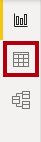
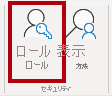
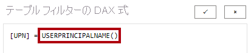
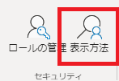
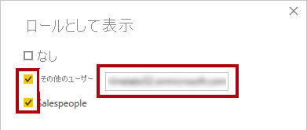
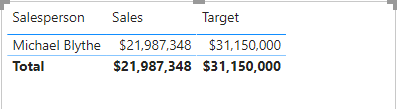

---
lab:
  title: 行レベルのセキュリティを実行する
  module: Enforce Row-Level Security
---


# **行レベルのセキュリティを適用する**

## **ラボのストーリー**

このラボでは、営業担当者が確実に自分の担当地域の売上データだけを分析できるように、行レベルのセキュリティを適用します。

このラボでは、次の作業を行う方法について説明します。

- 行レベルのセキュリティを適用する
- 動的メソッドと静的メソッドのいずれかを選択する

**このラボの実施には約15分かかります。**

## **開始するには**

1. この演習を完了するには、まず Web ブラウザーを開き、次の URL を入力して zip フォルダーをダウンロードします。

    ```
    https://github.com/MicrosoftLearning/PL-300-Microsoft-Power-BI-Data-Analyst/raw/Main/Allfiles/Labs/11-secure-data-access/11-secure-data.zip
    ```

    フォルダーを **C:\Users\ctct\Downloads\11-secure-data** フォルダーに展開します。

    **11-Starter-Sales Analysis.pbix** ファイルを開きます。

    > ***注**: **[キャンセル]** を選択すると、サインインを閉じることができます。 他のすべての情報ウィンドウを閉じます。 変更の適用を求めるメッセージが表示されたら、**[後で適用]** を選択します。

## **行レベルのセキュリティを適用する**

このタスクでは、行レベルのセキュリティを適用して、営業担当者が自分の担当地域での売上のみを表示できるようにします。

1. テーブル ビューに切り替えます。

   

1. **[データ]** ペインで、**Salesperson (Performance)** テーブルを選択します。


1. データを確認すると、Michael Blythe (EmployeeKey 281) の UPN の値が **michael-blythe@adventureworks.com** になっています。

    ''Michael Blythe の営業担当地域は、米国北東部、米国中部、米国南東部の 3つが設定されています。''

1. **[ホーム]** リボン タブで、 **[セキュリティ]** グループ内から **[ロールの管理]** を選択します。

    

1. **[セキュリティ ロールを管理する]** ウィンドウで、**[+新規]** を選択します。

1. ボックスで、選択したテキストをロールの名前を **Salespeople** に変更します。

1. フィルターを割り当てるには、**Salesperson (Performance)** テーブルを選択し、 **[DAXエディターに切り替える]** をクリックします。

1. **[ルール]** の画面で、 以下の式を入力して **[保存]** を選択します。保存が完了したら[セキュリティロールを管理する]のウィンドウを閉じます。

   ```DAX
   [UPN] = USERPRINCIPALNAME()
   ```

   "USERPRINCIPALNAME() は、認証されたユーザーの名前を返す Data Analysis Expressions (DAX) 関数です。*つまり、**Salesperson (Performance)** テーブルは、モデルをクエリするユーザーのユーザー プリンシパル名 (UPN) によってフィルター処理されます。"*

   

1. モデルビューに切り替えます。セキュリティ ロールをテストするには、**[モデリング]** リボン タブで、**[セキュリティ]** グループ内から **[表示方法]** を選択します。

   

1. **[ロールとして表示]** ウィンドウで **[その他のユーザー]** 項目を選択してから、対応するボックスに「**michael-blythe@adventureworks.com**」と入力します。

1. **[Salespeople]** ロールにチェックを入れて、 **[OK]** をクリックします。

   "この構成により、**Salespeople** ロールと、Michael Blythe のユーザーが使用されることになります。"

   

1. レポート ページの上に、テストのセキュリティ コンテキストを説明するバナーが表示されていることに注目してください。

1. テーブル ビジュアルでは、営業担当者 **Michael Blythe** のみが表示されていることに注目してください。

    

1. テストを停止するには、バナーの右側にある **[表示の停止]** を選択します。

1. **[Salepeople]** ロールを削除するには、 **[セキュリティ]** グループ内から **[ロールの管理]** を選択します。

    

1. **[セキュリティロールを管理する]** ウィンドウで、作成済みのロールにある省略記号をクリックして **[削除]** を選択します。 

このタスクでは、ラボを完了します。

1. **[保存]** を選択し、Power BI Desktop ファイルを保存してラボを終了します。

"注: Power BI Desktop ファイルが Power BI サービスに発行されるときに、発行後のタスクを完了して、セキュリティ プリンシパルを **[Salespeople]** ロールにマップする必要があります。このラボでは行いません。"
