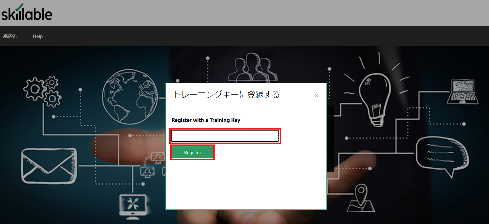
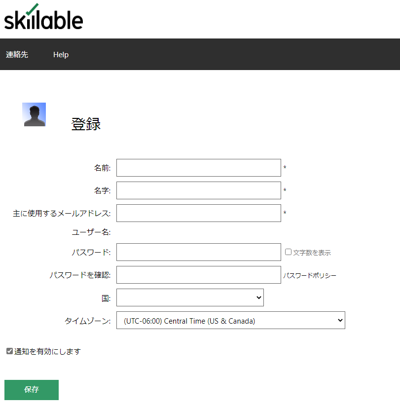
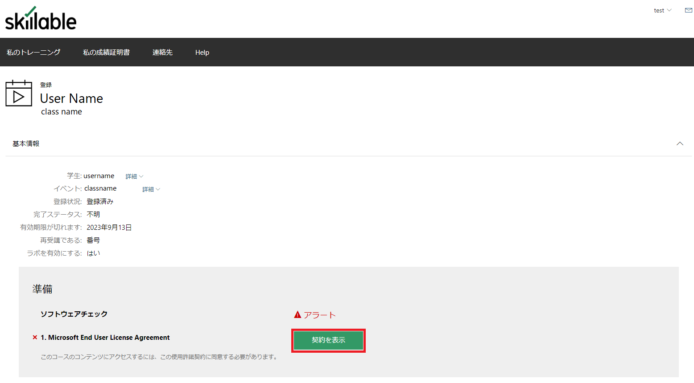
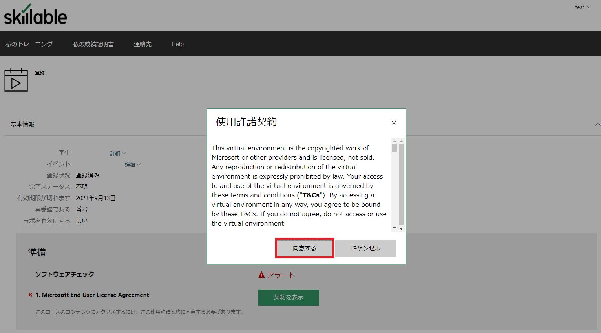
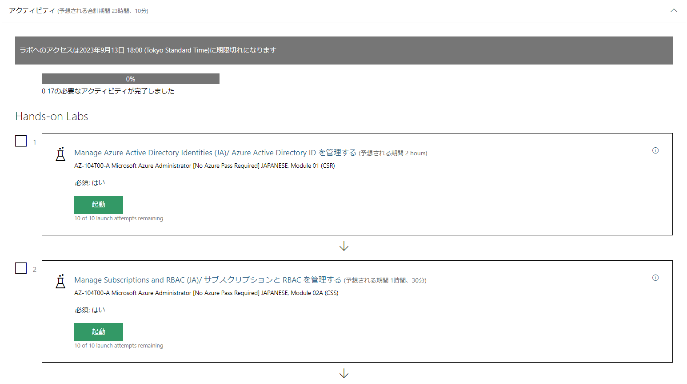
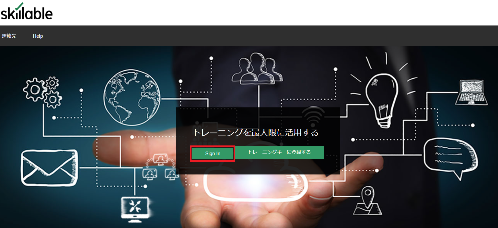
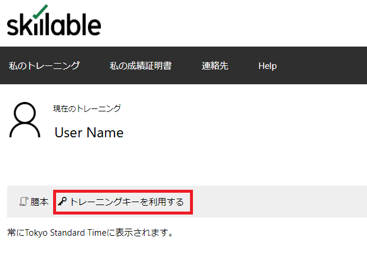
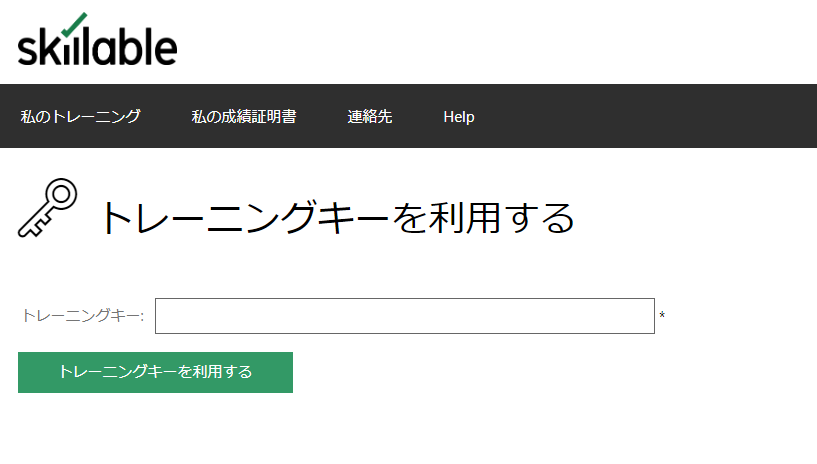
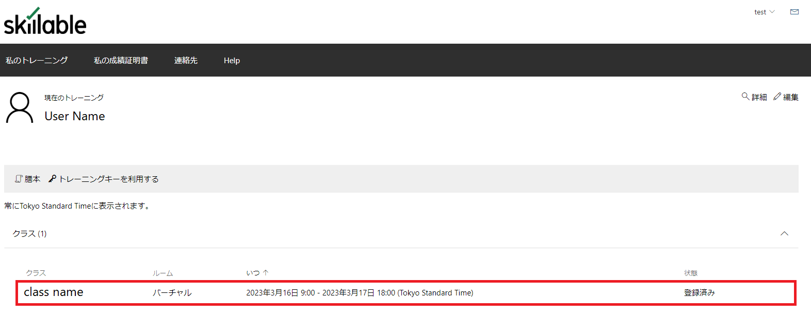

# 演習環境セットアップ

## 概要

本作業では、Azure上で演習を実施するために必要な**Skillableアカウントの作成**、**トレーニングキーの登録**を行います。

以下の手順を実施することで、演習環境を使用することができます。

## 実施内容

本作業では、以下のタスクの内いずれかを実施します。

Skillableを**使用したことがない**方は**タスク1**を、**使用したことがある**方は**タスク2**を実施してください。

- タスク1：Skillableアカウントの作成
- タスク2：トレーニングキーを利用する

### 実施予想時間：10分

## 手順

### タスク1：Skillableアカウントの作成

このタスクでは、演習環境を提供する**Skillable**のサービスを利用するためのアカウントを作成します。

注：既にSkillableアカウントをお持ちの方は作成不要です。ご自身のアカウントでログインし、タスク2へ進んでください。

1. **[Skillable](https://alh.learnondemand.net/)** にアクセスして、「**トレーニングキーに登録する**」のボタンをクリックします。

   

   

2. 表示されたポップアップ内のテキストボックスに講師から提供されたトレーニングキーを入力し、「**Register**」のボタンをクリックします。

   

   

3. ユーザー情報を入力する画面が表示されます。必要事項を入力して、最後に「**保存**」ボタンをクリックします。

   

   **主に使用するメールアドレス**がSkillableのログインに使用するユーザー名となります。そのため、ユーザー名については自動入力されます。

   

4. アカウントが作成され、トレーニングキーが紐づけられます。登録したコース情報が表示されるため、「**準備**」の項目にある「**契約を表示**」のボタンをクリックし、**使用許諾契約**に「**同意**」します。

   

   

   

   

5. 使用許諾契約に同意することで、コース内容に合わせたラボが使用可能になります。講師の指示に従って各ラボを起動して演習を実施してください。

   

### タスク2：トレーニングキーを利用する

1. **[Skillable](https://alh.learnondemand.net/)** にアクセスして、「**Sign In**」のボタンをクリックします。

   

   

2. 連携アカウント、もしくはSkillableのユーザーIDを用いてサインインします。

   

   

3. サインインが完了したら、初期画面にて「**トレーニングキーを利用する**」をクリックします。

   

   

4. 表示されたテキストボックスに講師から提供されたトレーニングキーを入力し、「**トレーニングキーを利用する**」のボタンをクリックします。

   

5. 使用したトレーニングキーに応じてクラスが追加されます。クラスに移動することで演習環境を使用することができます。

   

演習環境の使用開始手順については以上となります。

